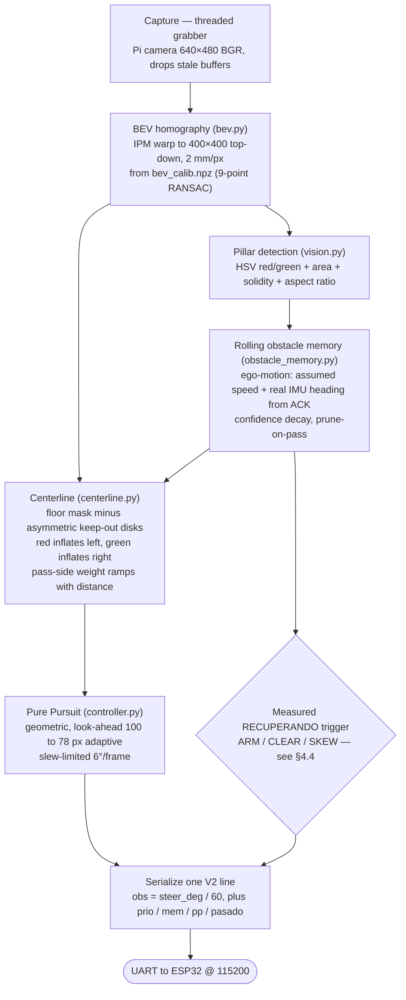
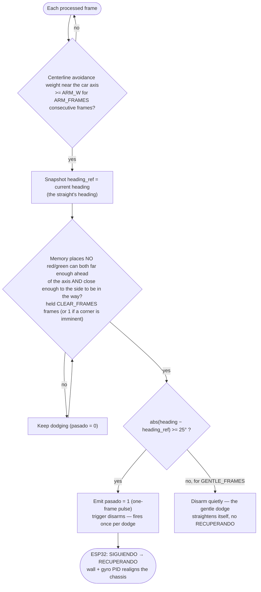
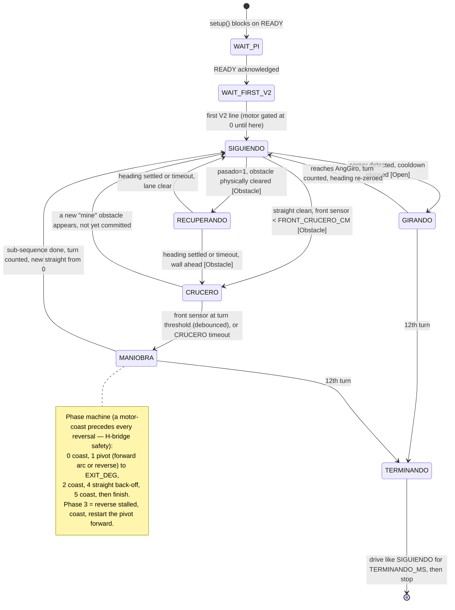
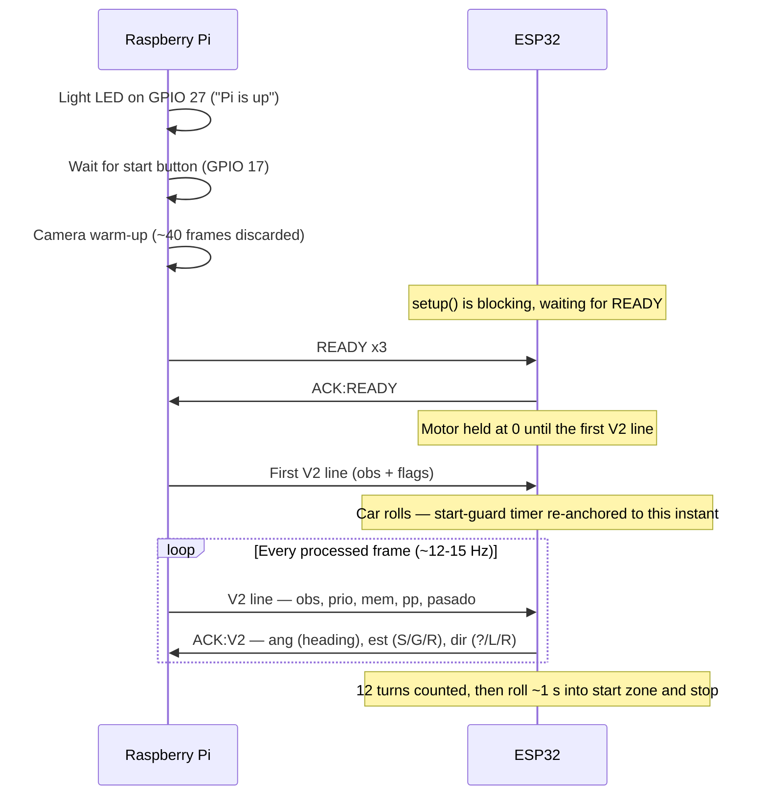
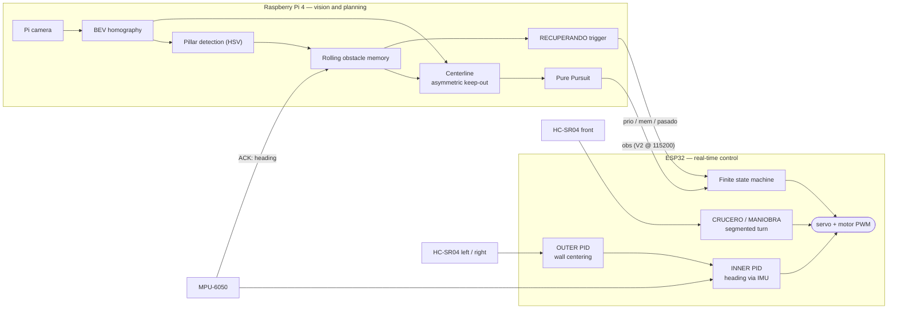
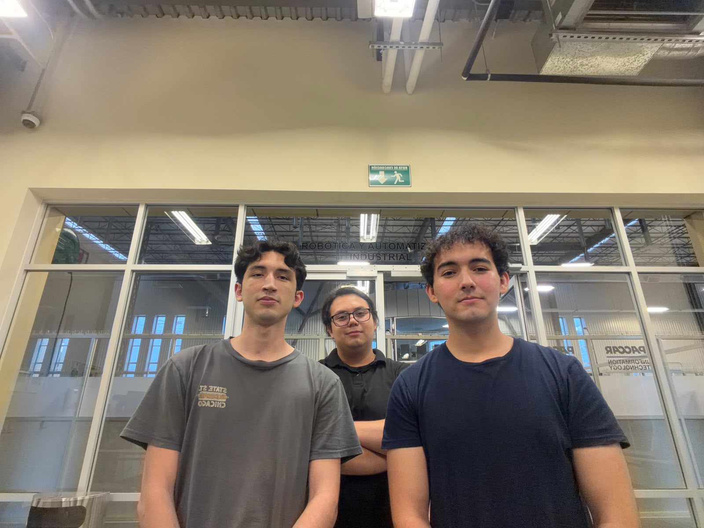

# WRO 2026 — Future Engineers | Self-Driving Car

> **Team:** FoxRobotics
> **| Members:** Erick Blanco · Jesse Banda · César Emiliano Ahumada
> **| Coach:** Daniel Millan
> **| Country / Region:** México — Baja California
> **| Season:** 2026

---

## Table of Contents

1. [Vehicle Overview](#1-vehicle-overview)
   - [1.1 Design goals](#11-design-goals) · [1.2 Bill of Materials](#12-bill-of-materials)
2. [Mechanical Design & Mobility](#2-mechanical-design--mobility)
   - [2.1 Chassis selection](#21-chassis-selection) · [2.2 Wheels](#22-wheels) · [2.3 Drive system (torque vs. speed)](#23-drive-system-torque-vs-speed-analysis) · [2.4 Steering](#24-steering--rack-and-pinion-with-ackermann-geometry) · [2.5 Custom parts & assembly](#25-custom-parts--assembly)
3. [Power Architecture & Sensors](#3-power-architecture--sensors)
   - [3.1 Power budget](#31-power-budget) · [3.2 Sensor selection and placement](#32-sensor-selection-and-placement) · [3.3 PCB & wiring](#33-pcb--wiring)
4. [Software Architecture](#4-software-architecture)
   - [4.1 System overview](#41-system-overview--two-controllers-one-link) · [4.2 Inter-controller protocol ("V2")](#42-inter-controller-protocol-v2) · [4.3 Vision pipeline](#43-vision-pipeline-raspberry-pi--pure_pursuit) · [4.4 Obstacle handling](#44-obstacle-handling-obstacle-challenge) · [4.5 ESP32 state machine](#45-esp32-finite-state-machine-srcesp32purepursuitpurepursuitino) · [4.6 Cascade PID](#46-cascade-pid-always-running-underneath) · [4.7 Startup handshake](#47-startup-handshake) · [4.8 Development status](#48-development-status)
5. [Systemic Thinking & Engineering Decisions](#5-systemic-thinking--engineering-decisions)
   - [5.1 Subsystem interaction map](#51-subsystem-interaction-map) · [5.2 Key engineering trade-offs](#52-key-engineering-trade-offs) · [5.3 Iteration log](#53-iteration-log) · [5.4 Risk analysis](#54-risk-analysis) · [5.5 Failure & Incident log](#55-failure--incident-log)
6. [Testing & Validation](#6-testing--validation)
   - [6.1 How we test](#61-how-we-test) · [6.2 Results to date](#62-results-to-date) · [6.3 Validation matrix](#63-validation-matrix) · [6.4 Pre-run checklist](#64-pre-run-checklist-each-venue) · [6.5 Milestones](#65-milestones)
7. [How to Build & Run](#7-how-to-build--run)
   - [7.1 Hardware](#71-hardware-requirements) · [7.2 ESP32 firmware](#72-esp32-firmware) · [7.3 Raspberry Pi software](#73-raspberry-pi-software) · [7.4 Calibration](#74-calibration-before-each-venue) · [7.5 Run](#75-run) · [7.6 Autostart & deployment](#76-autostart--deployment)
8. [Repository Structure](#8-repository-structure)
9. [Videos](#9-videos)
10. [Photos](#10-photos)

**Companion document:** [Engineering Journal](ENGINEERING_JOURNAL.md) — the dated, phase-by-phase build log, from the pre-repo design work through today, tied to commits. [§5.3 Iteration log](#53-iteration-log) and [§6.5 Milestones](#65-milestones) are the thematic views of the same history.

---

# 1. Vehicle Overview

<p align="center">
  
</p>

Our vehicle is a custom-built autonomous car for the WRO 2026 Future Engineers — Self-Driving Cars challenge. It completes 3 laps around a randomized track, and in the Obstacle Challenge it also detects and correctly passes coloured traffic-sign pillars (**red → keep the pillar on the car's left / pass on its right; green → keep it on the right / pass on its left**) before parking at the end.

The car uses **two controllers working together**: a Raspberry Pi 4 runs the camera vision pipeline and the high-level path planner (Pure Pursuit), and an ESP32 runs the real-time control loop, the state machine and all the actuators. They talk over a UART link with a small line-based protocol ("V2"). This split is the central architectural decision of the project and is explained in [Section 4](#4-software-architecture) and [Section 5](#5-systemic-thinking--engineering-decisions).

**Key specifications:**

| Parameter | Value |
|---|---|
| Dimensions | 210 × 140 × 80 mm |
| Weight | 564 g |
| Drive type | Rear-wheel drive (RWD) |
| Steering | Ackermann rack-and-pinion, SG90 servo |
| High-level controller | Raspberry Pi 4 Model B (vision + Pure Pursuit) |
| Real-time controller | ESP32 DevKit (FSM, PID, motor & sensor I/O) |
| Inter-controller link | UART @ 115200 baud, line protocol "V2" (see §4.2) |
| Vision | Raspberry Pi Camera, NoIR wide-angle lens (FOV ≈ 120°), processed at 640 × 480 |
| Distance sensors | HC-SR04 (5V) × 3 — left, right, front — via 5V↔3.3V level shifter |
| IMU | MPU-6050 (gyroscope + accelerometer) |
| Drive motor | N20 DC gear motor (50:1) + 2:1 LEGO stage → 100:1 total |
| Motor driver | TB6612FNG |
| Battery | 3S LiPo 11.1 V 2200 mAh |
| Logic power | MINI560 step-down, 5 V |

## 1.1 Design goals

One reliable vehicle that finishes **both** challenges — scoring for completing three laps consistently over completing them fast. Everything below follows from that.

- **Fixed architecture from day one: Raspberry Pi 4 + ESP32.** The Pi does *all* image processing and vision; the ESP32 does *all* peripheral I/O — both sensing and actuation. This split was decided before the first line of code and never revisited.
- **Small footprint for maneuverability.** Comfortably inside the rulebook envelope with ~10 cm of margin on width and length — the car is ≈ 20 × 10 cm, deliberately smaller than the limit so it has room to maneuver in the obstacle field.
- **Mechanically extensible.** The chassis and the PCB were designed so components could be added later without a redesign. This paid off directly: the front ultrasonic — added for the obstacle-round segmented turn (see [§4.5](#45-esp32-finite-state-machine-srcesp32purepursuitpurepursuitino)) — went from idea to mounted-and-wired in under 30 minutes because both the chassis and the PCB already had the space and a spare header.
- **Tight-turn capable.** Rack-and-pinion steering driving both wheels symmetrically ([§2.4](#24-steering--rack-and-pinion-with-ackermann-geometry)) so the car can take the obstacle-round corners without a multi-point turn.
- **Room for a printed differential** so the rear wheels can turn at different speeds through a corner without scrub.
- **Electronics-first packaging.** The chassis was sized around the electronics — the Raspberry Pi 4 above all — and the PCB was then laid out to fit the finished mechanical model, not the other way around.

## 1.2 Bill of Materials

### Custom Manufactured Parts

| ID | Component | Description | Quantity | Supplier | Approximate Cost |
|---|---|---|---|---|---|
| 1 | BaseChasis | Main body of the vehicle. | 1 | Custom made, 3D printed | 1.6 USD |
| 2 | TopShell | Upper part of the vehicle. | 1 | Custom made, 3D printed | 1 USD |
| 3 | Cremallera | Rack used for steering. | 1 | Custom made, 3D printed | 0.1 USD |
| 4 | ServoGearDirection | Pinion for the steering system, directly connected to the servo. | 1 | Custom made, 3D printed | 0.5 USD |
| 5 | LinkageDirection | Linkage between the rack and steering knuckle. | 2 | Custom made, 3D printed | 0.05 USD |
| 6 | SteeringKnuckle | Allows lateral wheel movement for steering. | 2 | Custom made, 3D printed | 0.15 USD |
| 7 | DCsupport | Holds the DC motor in place. | 1 | Custom made, 3D printed | 0.05 USD |
| 8 | RingDifferential | Main driven gear of the differential that transfers power to the axle assembly. | 1 | Custom made, 3D printed | 0.25 USD |
| 9 | PlanetDifferential | Allows torque distribution between both wheels while enabling different wheel speeds during turns. | 2 | Custom made, 3D printed | 0.1 USD |
| 10 | PinionDifferential | Transfers rotational motion from the motor to the differential gear system. | 1 | Custom made, 3D printed | 0.1 USD |
| 11 | SunDifferential | Transfers torque from the differential gears to the wheel axle. | 2 | Custom made, 3D printed | 0.1 USD |
| 12 | CameraBase | Holds the camera frame in place. | 1 | Custom made, 3D printed | 0.1 USD |
| 13 | CameraBack | Rear section of the camera frame. Connects to the CameraBase. | 1 | Custom made, 3D printed | 0.1 USD |
| 14 | CameraFront | Camera frame. | 1 | Custom made, 3D printed | 0.2 USD |
| 15 | UltrasonicSupport | Holds an ultrasonic sensor in place (used for the left, right and front sensors). | 3 | Custom made, 3D printed | 0.3 USD |

---

### LEGO Components

| ID | Component | Description | Quantity | Supplier | Approximate Cost |
|---|---|---|---|---|---|
| 16 | Lego 6135494 | Front wheel axle. | 2 | LEGO | 0.8 USD |
| 17 | Lego 4535768 | Rear wheel axle. | 2 | LEGO | 1 USD |
| 18 | Lego 6121485 | Reduces friction on the rear wheels. | 2 | LEGO | 0.4 USD |
| 19 | Lego 4299389 | Rim for rear wheels. | 2 | LEGO | 1.2 USD |
| 20 | Lego 4184286 | Tires for rear wheels. | 2 | LEGO | 3.5 USD |
| 21 | Lego 6251174 | Rim for front wheels. | 2 | LEGO | 1.2 USD |
| 22 | Lego 6182551 | Tires for front wheels. | 2 | LEGO | 3.82 USD |

---

### Electronics

| ID | Component | Description | Quantity | Supplier | Approximate Cost |
|---|---|---|---|---|---|
| 23 | ESP32 | Real-time controller: sensor I/O, cascade PID, finite state machine, actuator PWM. | 1 | Unit Electronics | 8 USD |
| 24 | Raspberry Pi 4 Model B | High-level controller: computer vision and Pure Pursuit path planning. | 1 | Amazon | 60 USD |
| 25 | Mini560 5V | Step-down regulator powering the Raspberry Pi, ESP32 and peripherals. | 1 | Amazon | 6 USD |
| 26 | MPU 6050 | 6-axis IMU used to measure angular velocity and integrate heading. | 1 | Unit Electronics | 3 USD |
| 27 | HC-SR04 | Ultrasonic distance sensors — left, right (wall following) and front (obstacle-round cornering). | 3 | Unit Electronics | 10.5 USD |
| 28 | Level Shifter | Logic-level converter for the 5 V HC-SR04 echo lines into the 3.3 V ESP32. | 1 | Unit Electronics | 7 USD |
| 29 | Driver TB6612FNG | Motor driver controlling speed and direction of the DC drive motor. | 1 | Unit Electronics | 5 USD |
| 30 | RaspiCamera V2 | Camera module used for computer vision. | 1 | Amazon | 10 USD |
| 31 | Custom PCB | Printed circuit board for power distribution and electronic connections. | 1 | JLCPCB | 5 USD |

---

### Power System

| ID | Component | Description | Quantity | Supplier | Approximate Cost |
|---|---|---|---|---|---|
| 32 | Ovonic 2200mAh 3S | 3-cell LiPo battery powering the robot's electronics and drive system. | 1 | E-Bay | 13 USD |

---

### Actuators

| ID | Component | Description | Quantity | Supplier | Approximate Cost |
|---|---|---|---|---|---|
| 33 | N20 with 50:1 reduction | DC gear motor providing torque for robot movement. | 1 | Unit Electronics | 6 USD |
| 34 | SG90 Servo | Micro servo motor used for steering control. | 1 | Unit Electronics | 6 USD |

---

### Fasteners

| ID | Component | Description | Quantity | Supplier | Approximate Cost |
|---|---|---|---|---|---|
| 35 | M3 Screws | Used for structural assembly and component mounting. | 23 | Local Hardware Store | 1 USD |
| 36 | M3 Nuts | Used to secure structural and electronic components. | 1 | Local Hardware Store | 0.05 USD |
| 37 | M2 Nuts | Used to secure servo motor and servo pinion | 3 | Local Hardware Store | 0.15 USD |

### Total Estimated Cost

| Total |
|---|
| ~155 USD |


---

# 2. Mechanical Design & Mobility

### 2.1 Chassis selection

The chassis was designed from scratch to fit all the components we needed for competition. We printed it in red and black SUNLU PLA on a Bambu Lab A1, keeping the structure as light as possible without sacrificing the rigidity the drivetrain and electronics require.

For wheel transmission shafts, we used LEGO axles throughout: part 6135494 for the front and part 4535768 for the rear. This wasn't an aesthetic choice — LEGO axles have much better dimensional consistency than fully printed shafts, which flex under load and cause alignment issues. We also added LEGO bushings (6121485) to the rear axle to cut down on friction between moving parts.

| Component   | Material / Part | Purpose                 |
| ----------- | --------------- | ----------------------- |
| Chassis     | SUNLU PLA       | Main robot structure    |
| Front Axles | LEGO 6135494    | Power transmission      |
| Rear Axles  | LEGO 4535768    | Rear drivetrain support |
| Bushings    | LEGO 6121485    | Friction reduction      |
| Printer     | Bambu Lab A1    | Manufacturing process   |

We used PLA because it prints fast, doesn't warp like ABS, and is stiff enough for indoor competition conditions. PETG has better impact resistance and ABS handles heat better, but neither of those properties matters much for a robot running on a flat mat indoors. What did matter was being able to iterate quickly and get consistent parts, and PLA delivered on both.

### 2.2 Wheels

We tested several wheel options before settling on LEGO parts. The rear wheels use rim 4299389 with tire 4184286, and the front uses rim 6251174 with tire 6182551. Both have a 43 mm outer diameter, which keeps the ride height even front to rear.

Since the drivetrain already uses LEGO axles, LEGO-compatible rims were the obvious fit — they mount directly without adapters, which removes a potential source of wobble at the wheel interface.

The 43 mm diameter was also validated against our motor RPM target. At our gear ratio, this diameter puts normal operation in the 40–70% PWM range, which gives us enough resolution for smooth speed control. A noticeably larger wheel would push operating duty cycles above 85% and compress the usable throttle range.

We ran the car at full throttle on the competition mat surface and saw no detectable slip at the rear. The LEGO rubber compound grips the white matte WRO field without any prep needed.

### 2.3 Drive system (torque vs. speed analysis)

The main drive is an N20 DC motor with a 50:1 internal gearbox — compact at 12 × 10 × 26 mm and still enough torque for a ~1.5 kg vehicle. Between the motor output shaft and the differential, we added a 2:1 LEGO gear stage, bringing the total drivetrain reduction to **100:1** and estimated rear axle torque to about 1.76 kg·cm.

**Why 100:1 and not just 50:1?**

We ran the 50:1 configuration first. It was faster, but corner exits were inconsistent — the rear wheels would occasionally lose traction under acceleration, causing yaw disturbances the PID couldn't fully catch. At 100:1, top speed dropped but torque delivery became smooth and predictable all the way through the speed range. Corner exits became repeatable, which turned out to be a prerequisite for reliable PID tuning.

The ratio also keeps the motor in its efficient RPM band during most of the run, which matters because the motor shares a power source with the logic rail.

The car completes all three Open Challenge laps in about 12 seconds at just 60% motor speed. That headroom is useful if we need to push speed in later iterations.

**The takeaway:** we prioritized consistency over raw speed. A robot that reliably finishes 3 laps scores more than one that's faster but unpredictable.

### 2.4 Steering — rack-and-pinion with Ackermann geometry

Steering is controlled by an SG90 servo connected to both front knuckles through a rack-and-pinion mechanism with symmetric tie rods.

**Mechanism specs:**

| Parameter | Value |
|---|---|
| Servo | SG90 (0°–180° range) |
| Firmware straight-ahead trim | 80° (servo-horn spline offset; `centroServo` in firmware) |
| Pinion | Module 1, 14 teeth |
| Pinion pitch diameter | 14 mm (dp = m × z = 1 × 14) |
| Pinion outer diameter | 16 mm (dp + 2×addendum = 14 + 2) |
| Rack | Module 1, 11 teeth, 27.5 mm total travel |
| Rack displacement per servo degree | 0.1222 mm/° |
| Transmission ratio | 2.50° servo : 1° wheel |
| Geometric wheel steering range | ±43° from center |
| Firmware-clamped servo command | 20°–150° (≈ ±35° usable at the wheel) |

**Kinematic analysis:**

The 14 mm pitch diameter gives a pitch circumference of 43.98 mm. Each degree of servo rotation moves the rack 0.1222 mm. At 90° per side from center, the rack travels 11.00 mm per side — producing ±43° at the front wheels.

The outer diameter of 16 mm confirms the module (d_outer = dp + 2×m = 14 + 2 = 16 mm).

The 2.50:1 ratio reduces steering sensitivity at the wheel, which gives the inner control loop finer resolution at its update rate. A lower ratio would make steering response too abrupt.

The firmware never commands the full mechanical range: `escribirServo()` is clamped to 20°–150° (about ±35° at the wheel) so a saturated control output can't drive the rack into its physical end stop. That still clears the tightest Open-Challenge corridor (600 mm) and the maneuvering the Obstacle Challenge needs.

**Why rack-and-pinion over a direct servo arm?**

A direct arm only controls one wheel directly. The opposite knuckle, linked by a fixed-length tie rod, gets an angle that's geometrically correct only at center — producing toe error everywhere else. The rack pushes both tie rods symmetrically, so both wheels get the right angle at every steering position. Combined with the Ackermann geometry of the knuckles, each wheel tracks its own correct turning radius. No lateral scrub, and steering response is linear across the full range.

### 2.5 Custom parts & assembly

Every structural part is 3D-printed in SUNLU PLA on a Bambu Lab A1. The mechanical model was built first; the PCB was then laid out to fit it. Editable SolidWorks parts are in [`models/CAD/`](models/CAD/), printable meshes in [`models/STL/`](models/STL/), isometric renders in [`models/renders/`](models/renders/).

<p align="center">
  
</p>

| Render | Part | Function / design note |
|---|---|---|
|  | **BaseChasis** | Main structure. Sized around the electronics (Raspberry Pi 4 first); carries the PCB, steering, drivetrain and every sensor mount. |
|  | **TopShell** | Top cover — closes the electronics bay and protects the wiring. |
|  | **ServoGearDirection** | Pinion pressed onto the SG90 output shaft — module 1, 14 teeth. |
|  | **Cremallera** (rack) | Module 1, 11 teeth, 27.5 mm travel. Converts servo rotation into lateral travel for the tie rods. |
|  | **LinkageDirection** ×2 | Tie rods from the rack ends to the steering knuckles — symmetric, so both wheels get the correct angle at every rack position. |
|  | **SteeringKnuckle** ×2 | Front-wheel pivots; their geometry sets the Ackermann steering angles. |
|  | **Differential** (Ring / Planet ×2 / Pinion / Sun) | Printed open differential — lets the rear wheels turn at different speeds through a corner. |
|  | **DCsupport** | Mounts the N20 gear motor to the chassis. |
|  | **UltrasonicSupport** ×3 | Two identical side mounts; one slightly smaller front mount, added later for the obstacle-round segmented turn. |
|  | **CameraHold** | Structure in charge of holding the camera. Sets the fixed ~15° downward tilt the BEV homography is calibrated against ([§3.2](#32-sensor-selection-and-placement)). |

#### Assembly order

1. **Chassis base** — the reference part everything mounts to.
2. **Steering** — press the pinion onto the servo and seat the servo in the chassis; slide in the rack; link each rack end to a SteeringKnuckle with a LinkageDirection tie rod; fit the knuckles and the front LEGO axles.
3. **Drivetrain** — N20 motor into the DCsupport; assemble the printed differential; rear LEGO axles with bushings.
4. **Sensor mounts** — the two side UltrasonicSupports (identical) and the smaller front one; the camera cage (base + back + front) with the camera.
5. **Electronics** — PCB onto the chassis bosses; wire the Pi 4, ESP32, the three HC-SR04 (through the level shifter), the MPU-6050, the TB6612 + motor, the servo, and the start button + status LED.
6. **TopShell** — close the bay.

All fasteners are M3 (M2 nuts on the servo horn and pinion).

---

# 3. Power Architecture & Sensors

### 3.1 Power budget

The whole vehicle runs off an Ovonic 2200mAh 3S LiPo. Power splits two ways: the motor driver takes battery voltage directly for the DC motor, and everything else goes through a MINI560 step-down converter producing a stable 5V at up to 5A.

| Rail | Source | Consumers | Max Current Draw |
|---|---|---|---|
| 5V Logic | MINI560 Step-Down Converter | Raspberry Pi 4 + RaspiCam V2, ESP32, HC-SR04 ×3, MPU6050, SG90 | ~4.0 A |
| Battery / Main Power | Ovonic 2200mAh 3S LiPo | Entire vehicle power distribution | ~35 A discharge capability |
| Motor Power | Motor Driver directly from 3S LiPo | DC drive motor | ~1.6 A peak |
| 3.3V Internal | ESP32 internal regulator | I²C communication and internal ESP32 logic, Level Shifter | ~200 mA |

The Ovonic battery is rated 120C continuous, which is theoretically 264 A. We're drawing about 4.5 A peak — under 2% of its discharge capability. There's no shortage of headroom here.

The Raspberry Pi and the ESP32 share the 5 V rail but the DC motor is fed straight from the battery through the TB6612FNG, so stall-current spikes on the motor never sag the logic supply.

### 3.2 Sensor selection and placement

| Sensor | Purpose | Placement | Notes |
|---|---|---|---|
| Raspberry Pi Camera Module V2 | Lane, corner-line and pillar detection | Front-center, ~15° downward tilt | Main vision system, OpenCV on the Pi |
| HC-SR04 (left) | Left wall distance | Left side of the chassis | Feeds the wall-centering PID |
| HC-SR04 (right) | Right wall distance | Right side of the chassis | Feeds the wall-centering PID |
| HC-SR04 (front) | Distance to the wall ahead when approaching a corner | Front bumper, facing forward | Obstacle round only — triggers the CRUCERO → MANIOBRA sequence |
| MPU-6050 | Heading integration during cornering and recovery | Center of chassis | Gyro Z integrated into `anguloGyro`, echoed back to the Pi |

#### Camera system

The camera handles lane geometry (via a bird's-eye-view transform), the orange corner-line markers, and red/green pillar detection. Image processing runs on the Raspberry Pi 4 with OpenCV in real time and drives the Pure Pursuit planner.

It is mounted front-center with a ~15° downward tilt. We tested a horizontal mount first, but that captured too much background, which slowed detection and added noise. Tilting it down focuses the field of view on the track and the obstacle zone, which cut both false positives and computational load. The exact tilt is baked into the bird's-eye-view homography during calibration (see §4.3), so the mount must not move after calibration.

The lens is a wide-angle **NoIR** unit (~120° FOV), chosen over the original ~63° lens so the camera sees far enough ahead to react to a pillar and read the corner on the same frame. The wide lens ships without an IR-cut filter, which gave the raw image a heavy red cast and broke every HSV mask. The libcamera capture pipeline pins white-balance instead of letting it float — `libcamerasrc awb-enable=false colour-gains=<1.2,1.5>` — so the correction holds across venue lighting, and the pillar HSV ranges were re-tuned on the corrected image (see [ERR-03](#err-03--wide-angle-noir-lens-put-a-red-cast-on-every-frame)).

#### HC-SR04 ultrasonic sensors

The left and right sensors drive lateral positioning and wall following. The **front** sensor was added for the Obstacle Challenge: because that round uses a segmented, stop-and-maneuver turn instead of a continuous arc (see §4.5), the car needs to know how far it is from the wall ahead so it can decide *when* to stop cruising and *which* maneuver (forward arc or reverse pivot) to run.

We originally tested VL53L0X time-of-flight sensors. On paper they win — ±3 mm accuracy versus ±15 mm for the HC-SR04, and a narrower beam. In practice, the black competition walls absorbed their 940 nm IR signal and consistently returned out-of-range readings at 300 mm. The HC-SR04 reflects off any surface regardless of color. We went with reliability over precision and made up the accuracy difference with software filtering (EMA on all three channels, plus a 5-sample median on the front channel to reject spikes before they can trigger a maneuver).

#### MPU-6050 IMU

The MPU-6050 gives heading and rotation data during cornering and recovery. The gyro Z axis is integrated each loop into `anguloGyro`, with a 1°/s deadband to suppress MEMS thermal drift on straights. On startup the firmware averages several hundred stationary samples to compute the gyro bias (`calcGyroOffsets`); if that offset comes back unusually large the firmware halves the integration scale as a safety net. The integrated heading is also sent back to the Pi in every acknowledgement so the vision side can dead-reckon obstacle positions (see §4.4).

### 3.3 PCB & wiring

A custom two-layer PCB is the vehicle's backplane: it distributes power and carries every signal line between the ESP32, the sensors and the motor driver, so there is no breadboard or flying-wire harness to work loose. This is what let the front ultrasonic go in in under 30 minutes ([§1.1](#11-design-goals)) — the header was already there. The full editable KiCad project is in [`electrical/WRO_RevA/`](electrical/WRO_RevA/).

**Schematic** ([`schemes/schematic.png`](schemes/schematic.png)):

<p align="center">
  
</p>

The ESP32 DevKit (`U1`) sits at the centre. Battery voltage (~11.1 V, 3S) comes in at the `VCC` screw terminal (`J1`) and splits two ways: the motor driver takes it directly, and a MINI560 buck (`V1`, bulk caps `C1`–`C4`) drops it to the 5 V logic rail. The RDB-14450 driver (`U2`) takes `PWM_MOTOR` / `AIN1` / `AIN2` from the ESP32 and drives `MOTOR_1/2` out to the screw terminal `J5`. The four HC-SR04s land on headers `US1`–`US4` (5 V / TRIG / ECHO / GND); their 5 V echo lines return through a BOB-12009 level shifter (`U3`) that steps `ECHO1`–`ECHO4` down to 3.3 V for the ESP32. The MPU-6050 (`U4`) is on I²C. The `TO_PI` header (`J3`) is the entire link to the Raspberry Pi — `RX` / `TX` for the V2 protocol, `READY` for the handshake, `PRGN` for the start button (`SW1`), plus 3.3 V / GND. Two status LEDs (`D1` PWR, `D2` READY) complete the operator interface from [§4.7](#47-startup-handshake).

**Populated board** ([`schemes/pcb_render.png`](schemes/pcb_render.png)):

<p align="center">
  
</p>

**Board outline** ([`electrical/PCB_dimensions.png`](electrical/PCB_dimensions.png)):

<p align="center">
  
</p>

The board is a custom non-rectangular shape (~55 mm at its widest) that nests into the chassis around the Raspberry Pi 4 and the drivetrain — the electronics-first packaging from [§1.1](#11-design-goals) in physical form. The cut-outs and the mounting-hole row let the PCB, the steering and the sensor mounts share one footprint without stacking height.

---

# 4. Software Architecture

### 4.1 System overview — two controllers, one link

Responsibility is split across two processors by hardware strength:

```
        RASPBERRY PI 4 (Python, OpenCV)                          ESP32 (Arduino / C++)
 ┌───────────────────────────────────────────┐    V2     ┌────────────────────────────────────┐
 │ Camera → BEV homography → floor centerline│   UART    │ readPiSerial()  →  parse V2        │
 │ Pillar detection (HSV) + corner-line track│  ──────►  │                                    │
 │ Rolling obstacle memory (dead reckoning)  │  115200   │ 6-state FSM                        │
 │ Pure Pursuit geometric controller         │           │  SIGUIENDO / GIRANDO / RECUPERANDO │
 │ RECUPERANDO trigger (measured state)      │  ◄──────  │  CRUCERO / MANIOBRA / TERMINANDO   │
 │ builds one V2 line per processed frame    │  ACK:V2   │ cascade PID (wall + gyro)          │
 └───────────────────────────────────────────┘   ang=    │ servo + motor PWM, HC-SR04, MPU    │
                                               est= dir= └────────────────────────────────────┘
```

- The **Pi** decides *where to steer*: it turns the camera frame into a top-down view, extracts a drivable centerline, runs a Pure Pursuit controller against it, and reduces the result to a single normalized steering value plus a few status flags. It processes 1 of every 3 captured frames (~12–15 Hz effective).
- The **ESP32** decides *how to drive*: it owns the 50 Hz control loop, the finite state machine, corner detection, the recovery behaviour, and every actuator. In the Obstacle round it treats the Pi's steering value as the primary reference while Pure Pursuit is active, and falls back to its own wall + gyro PID if the Pi goes silent for more than 800 ms. In the Open round it ignores the Pi's steer altogether and runs on wall + gyro PID the whole time (§4.5).

Why not one processor? Real-time GPIO timing (ultrasonic pulses, servo/motor PWM, gyro sampling) and non-deterministic OpenCV latency don't coexist well on one core. Linux can't guarantee a µs-accurate pulse while an HSV pass is running; a microcontroller can't run OpenCV. Splitting them lets each run at its own natural rate, and a late UART packet just means the ESP32 reuses the last command instead of stalling. This trade-off is analyzed in [Section 5](#5-systemic-thinking--engineering-decisions).

**Where to start reading the code:** the Pi loop is [`pure_pursuit/runtime_nuevo.py`](src/RASPI/cam/pure_pursuit/runtime_nuevo.py) (`run()` → per-frame block); the ESP32 loop is [`PurePursuit.ino`](src/ESP32/PurePursuit/PurePursuit.ino) (`loop()` → the `switch (estado)`). Every module is annotated in [Section 8](#8-repository-structure); tunables live in [`pure_pursuit/config.py`](src/RASPI/cam/pure_pursuit/config.py).

### 4.2 Inter-controller protocol ("V2")

One line per processed frame, newline-terminated, 115200 baud. The rest of Section 4 refers to these fields by name.

**Pi → ESP32:**

```
V2,obs=+0.123,turn=0,state=pp,prio=1,mem=18,pp=1,pasado=0,intr=0
```

| Field | Meaning |
|---|---|
| `obs` | Normalized steering, `steer_deg / 60`, range −1…+1 (`+` = right). |
| `turn` | Legacy directional hint — always `0`; turn direction is resolved on the ESP32 side. |
| `state` | Human-readable label for the journal (e.g. `pp`, `avoid_red`). |
| `prio` | `1` = an obstacle is actively being avoided → **ESP32 must not start a corner turn**. |
| `mem` | Frames of obstacle memory still live → also blocks corner detection while `> 0`. |
| `pp` | `1` = Pure Pursuit steering is authoritative (suspend the wall PID). |
| `pasado` | One-frame pulse: the Pi confirms the car has *physically* cleared an obstacle → enter RECUPERANDO. |
| `intr` | Interior-pass flag (disabled by default). |

**ESP32 → Pi:**

```
ACK:V2,ang=12.34,est=S,dir=L,...debug...
```

| Field | Meaning |
|---|---|
| `ang` | Integrated IMU heading `anguloGyro` (degrees); resets to 0 at each turn. |
| `est` | FSM state — `S` SIGUIENDO, `G` GIRANDO **or** MANIOBRA, `R` RECUPERANDO, `C` CRUCERO. |
| `dir` | Track turn direction — `?` until the first turn, then `L` / `R`. |

### 4.3 Vision pipeline (Raspberry Pi — `pure_pursuit/`)

Entry point: `pure_pursuit/runtime_nuevo.py`. Per processed frame:

1. **Capture** — a threaded grabber pulls frames from the Pi camera through a libcamera/GStreamer pipeline at 640 × 480 BGR, dropping stale buffers so the loop always sees the newest frame.
2. **Bird's-eye view (`bev.py`)** — a homography (inverse-perspective mapping) warps the camera frame to a top-down 400 × 400 image at 2 mm/px. The homography comes from `bev_calib.npz`, generated once by `calibrate.py` from a **3 × 3 grid of 9 physical floor markers** (RANSAC fit). We use 9 points, not the minimum 4: a 4-point fit is exact and can't detect a mis-click or extrapolate safely beyond the marked area, while 9 points let the solver average out click noise across the full range the centerline actually uses (from just ahead of the car out to ~550 mm).
3. **Pillar detection (`vision.py`)** — HSV masks for red and green, then contour filtering by area, **solidity** (compact blob ≈ 0.7–0.9, painted line < 0.4) and **aspect ratio** (< 2.2) so the mat's coloured lines are not mistaken for pillars.
4. **Centerline (`centerline.py`)** — a floor-colour mask in the BEV, minus inflated "keep-out" disks around each obstacle. The keep-out is **asymmetric per the WRO rule**: a red pillar inflates further to its *left* (car passes on the right), a green pillar further to its *right*. Rows are sampled bottom-to-top; each row blends the free-gap center with the WRO pass-side using a weight that ramps up as the car nears the can (not a binary switch). A 1-D moving average plus a per-step Δx clamp keep the path within the servo's curvature limit.
5. **Pure Pursuit (`controller.py`)** — a geometric pure-pursuit controller in BEV pixel space. Look-ahead is **adaptive**: it shrinks from 100 px toward 78 px as the nearest can closes *longitudinally*, so the car keeps translating and arcs around the can instead of pivoting in place. Output is slew-limited to 6°/frame to kill frame-to-frame steering whip.
6. **Serialize** — the steering angle is normalized (`obs = steer_deg / 60`) and packed into one V2 line with the status flags (§4.2).



#### How the Pure Pursuit controller works

Pure Pursuit is a path-tracking method: instead of reacting to an *error signal*, the controller looks a fixed distance ahead along the path — the **look-ahead** — picks the point on the centerline at that distance, and computes the single steering angle whose turning arc, starting from the car's current pose, passes exactly through that point. Every frame the target point moves forward along the centerline and the car "chases" it, so the trajectory is always a smooth arc onto the path rather than a hand-tuned reaction curve.

```
          centerline (from BEV)                 look-ahead point picked at
        ·····•·····•·····•···•···•  ← target    distance  ld  along the path
                            ╲
                             ╲  arc the steering angle produces
              ┌───┐           ╲
              │car│────────────•   robot pose (rear axle = reference)
              └───┘
                 └─ α = bearing to target,  steer = atan2(2·L·sin α, ld)
```

Why it fits this problem:

- The vision pipeline already produces a **path** (the centerline), not a point to servo onto — Pure Pursuit consumes that path directly.
- The look-ahead is a single, physically meaningful tuning knob: **short = cut hard toward the path** (fast dodge), **long = ease onto it** (smooth cruise). That is exactly the behaviour the obstacle logic needs, so avoidance is folded into the *same* controller by shrinking the look-ahead near a can instead of adding a separate avoidance mode.
- It degrades gracefully: a noisy or short path just moves the target point a little; there is no integrator to wind up and no error term to spike.

```python
dx = target[0] - robot_x          # lateral offset to the look-ahead point (BEV px)
dy = robot_y - target[1]          # forward distance to it
ld = max(1.0, math.hypot(dx, dy)) # actual chord length
alpha     = math.atan2(dx, dy)                                   # bearing to the point
steer_rad = math.atan2(2.0 * C.WHEELBASE_PX * math.sin(alpha), ld)  # pure-pursuit arc
steer_deg = math.degrees(steer_rad)

if bev_obstacles:                                   # a can is in play
    steer_deg *= self._distance_steer_gain(...)     # ramp 0.30→1.0 as it closes
steer_deg = max(-C.MAX_STEER_DEG, min(C.MAX_STEER_DEG, steer_deg))
steer_deg = clamp(steer_deg, prev ± C.PP_STEER_SLEW_DEG)   # 6°/frame slew limit
```

`adaptive_lookahead` shrinks the look-ahead from 100 px toward 78 px, and `_distance_steer_gain` ramps the steering scale from 0.30 up to 1.0, both as the nearest can closes. Both key off the **longitudinal** distance to the can (forward gap), not the Euclidean one: a can still off to the side but level with the car used to keep those values relaxed, and the car drove straight past the point where it should have started turning. The WRO pass-side bias (right of red, left of green) is *not* handled here — it is already baked into the centerline by `centerline.py`, so the controller only has to follow the path it is given.

If `bev_calib.npz` is missing, the runtime falls back to a simple reactive PID on the pillar's x-position in the raw frame (`RED_TARGET_PX` / `GREEN_TARGET_PX`) so the car is never left without a controller.

### 4.4 Obstacle handling (Obstacle Challenge)

**Rolling obstacle memory (`obstacle_memory.py`).** The BEV only contains what the camera sees *now*; as the car closes on a can, the can leaves the bottom of the frame, its keep-out disc vanishes, and the centerline snaps back to center — cutting the corner onto the can. The memory fixes this: seen cans are stored as `(x, y, colour, confidence)` in robot-relative BEV coordinates and, every frame, the ego-motion is applied to every remembered can — forward travel from an assumed speed, rotation from the **real IMU heading change** in the ESP32 acknowledgement:

```python
dheading = heading_deg - self._prev_heading          # real Δ from the ACK, degrees
ds_px    = (C.ROBOT_SPEED_MMS * dt_s) / C.MM_PER_PX  # assumed forward advance, BEV px
# a hard dodge rotates the car without translating it — shrink ds_px when |dheading| is large
ds_px   *= turn_brake(dheading)
self._advance(ds_px, dheading)     # each can: y += ds_px, then rotate −dheading about the robot
```

Fresh detections are merged in, unseen cans decay in confidence and are pruned once genuinely passed. The inflated keep-out therefore persists until the car has physically cleared the can. The `heading_deg` this relies on is exactly the value the ESP32 integrates for its own control (see §4.6) and echoes back — one shared heading, so the map rotates by the same angle the car actually turned.

**"Mine" vs "beyond the corner" (`corner_lines.py`).** The mat's orange corner lines are tracked row-by-row in the BEV. Each remembered can is classified as *mine* (on my straight, must be avoided) or *beyond* (on the next straight, ignore for now), with asymmetric hysteresis — quick to start avoiding, slow to stop — because starting to dodge is the safe side of a wrong call.

**Far hint (`far_hint.py`).** A PD controller on a pillar's offset in the *raw* camera frame (before it projects into the BEV range) nudges the steering to pre-center on a distant can, capped at ±12° so it can only hint, never dodge.

**Mid-turn detector (`mid_turn.py`).** While the ESP32 is turning, the rolling memory is disabled (its motion model assumes forward travel, which a pivot violates). This detector instead uses only the raw per-frame BEV projections and requires a same-colour can in a consistent position across several frames inside a close forward cone to "confirm" it. **Phase 1 (current): observe and log only** — it writes `[MTURN]` lines to the journal and does not yet change steering, so we can measure its reliability on-track before wiring it into the firmware.

#### Triggering RECUPERANDO from the obstacle memory

**The problem.** When the car has to swing wide around a can with no room to spare, it finishes the pass **crooked** — pointing 30–60° off the straight — and often with one wall out of ultrasonic range. At that exact moment the camera view is the least trustworthy (the centerline is short and skewed), so letting Pure Pursuit "straighten itself" from what it sees tends to over- or under-correct into a wall. The fix is to hand the wheel to the ESP32's wall + gyro PID (state `RECUPERANDO`) until the chassis is realigned — but *only* for a hard dodge. A gentle dodge with space to spare straightens itself fine and should not stop for a recovery.

**The trigger** (`_measured_recup_trigger` in [`runtime_nuevo.py`](src/RASPI/cam/pure_pursuit/runtime_nuevo.py)) does not dead-reckon the can itself — it reads the state the obstacle memory and the IMU already provide, and needs three things to line up:

```
1. ARM   a real dodge is in progress:
         the centerline's avoidance weight near the car's axis has been
         ≥ RECUP_MEAS_ARM_W for RECUP_MEAS_ARM_FRAMES straight frames.
         On arming, snapshot heading_ref = current heading (the straight's heading).

2. CLEAR the memory no longer places any Red/Green can both far enough ahead
         of the axis AND close enough to the side to be in the way
         (going straight, the car's edge would clear it) — held for
         RECUP_MEAS_CLEAR_FRAMES frames (or just 1 if a corner is imminent).

3. SKEW  |heading − heading_ref| ≥ RECUP_MEAS_HEADING_DEG   (25°)
         → there is actually something to straighten.

ARM && CLEAR && SKEW  →  emit pasado=1  (one-frame pulse)  →  ESP32 enters RECUPERANDO
CLEAR but never SKEW for RECUP_MEAS_GENTLE_FRAMES  →  disarm quietly, no RECUPERANDO
```



Condition 3 is what separates the two cases: same "can is now behind me" geometry, but only the crooked one triggers a recovery. The trigger disarms on fire, so it emits **once per dodge** — a can that lingers in memory while the ESP32 straightens can't re-fire it. The can positions it checks are the same `(x, y)` the memory maintains — corrected by fresh detections while the can is visible, and carried by the *same* ego-motion the centerline uses once it isn't (see the memory snippet above) — so the trigger and the path always agree on where the can is.

This replaced an earlier approach that anchored the can's position when first seen and dead-reckoned it forward with an *assumed* speed and a bicycle model; that anchor drifted 200–400 mm within 1–2 s and fired either early (nose into the can) or far too late.

### 4.5 ESP32 finite state machine (`src/ESP32/PurePursuit/PurePursuit.ino`)

```
enum Estado { SIGUIENDO, RECUPERANDO, GIRANDO, CRUCERO, MANIOBRA, TERMINANDO };
```



*This is the complete state machine as it stands on branch `SectionTurning` — the current firmware. One flag, `const bool rondaObstaculos`, selects the profile. `false` (Open Challenge): only `SIGUIENDO` / `GIRANDO` / `RECUPERANDO` / `TERMINANDO` are reachable and corners are the continuous `GIRANDO` arc. `true` (Obstacle Challenge): `GIRANDO` is replaced by the segmented `CRUCERO` → `MANIOBRA` sequence and the `pasado`-driven `RECUPERANDO` is enabled. `RECUPERANDO` never aborts on a new obstacle — it straightens the chassis first, then hands back to `SIGUIENDO`, or to `CRUCERO` if the corner is already in reach. The `main` branch still carries an earlier 3-state cut (`SIGUIENDO` / `RECUPERANDO` / `GIRANDO`); the `SectionTurning` merge is tracked as iteration log v3.0. `WAIT_PI` / `WAIT_FIRST_V2` are the startup handshake (§4.7).*

| State | Role |
|---|---|
| **SIGUIENDO** | Normal driving. In the **Obstacle round**, steering = Pi's Pure Pursuit value, blended with a light gyro correction (weight 0.12) and, only on a clean straight, the wall PID (weight 0.30). In the **Open round** the Pi's steer is ignored entirely — steering is pure wall PID + gyro PID (see §4.5.1). Watches for the next corner and for obstacle flags from the Pi. |
| **GIRANDO** | Continuous corner (**Open round only**). Servo held at full lock, motor speed ramped down in steps as `\|anguloGyro\|` grows, exits at `\|anguloGyro\| ≥ AngGiro` — **76°** in the Open round (the continuous turn coasts the rest on inertia) vs. 90° for the Obstacle round. The first corner latches the track's turn direction from whichever wall opened up. 12 corners = 3 laps → `TERMINANDO`. |
| **RECUPERANDO** | *(Obstacle round)* Entered on the Pi's `pasado=1` pulse. Vision is handed off; wall PID + gyro PID (with widened limits) straighten the chassis back into the lane. Exits when the heading error settles (with a timeout safety net for corners where one wall legitimately reads "open"). |
| **CRUCERO** | *(Obstacle round)* Straight is clean and a corner is near (front sensor < 80 cm). The car drives straight on heading toward the wall: far away, vision keeps the centerline straight; once inside `CRUCERO_GYRO_CM`, control is pure gyro + wall PID. A new obstacle sends it back to SIGUIENDO. |
| **MANIOBRA** | *(Obstacle round)* Replaces the continuous turn. At 30–60 cm from the wall a one-time decision is latched: **turn direction** = the side whose wall is open; **forward arc vs. reverse pivot** = chosen from the distance to the *outer* wall of the turn (tight against it → reverse pivot; room to swing → forward arc). A multi-phase sub-machine runs it, with motor-**coast** phases inserted between every direction reversal (plugging the H-bridge under load destroyed a TB6612 during testing). An optional short straight back-off afterward buys room on the new straight. Then it straightens, zeroes the heading for the new straight, counts the turn and returns to SIGUIENDO. |
| **TERMINANDO** | Entered automatically after the 12th turn **instead of braking on the spot**. Drives exactly like SIGUIENDO (same controller, but corner detection disabled) for `TERMINANDO_MS` (~1 s, tunable) so the car rolls forward into the start area, then cuts the motor and ends the race. Keeps the finish inside the start section instead of wherever the last corner happened to end. |

The turn-direction is latched once (all corners of a WRO track turn the same way); the forward-vs-reverse choice is made fresh at every corner from the distance to the **outer** wall of the turn ([`decidirManiobra()`](src/ESP32/PurePursuit/PurePursuit.ino)):

```cpp
// outer wall = the one that is NOT the opening (right turn → left wall, and vice-versa)
long distExt = maniobraGirarDer ? distL : distR;
maniobraReversa   = (distExt >= HUG_CM);                    // room to swing → reverse pivot
maniobraRetroceso = (distExt >  MANIOBRA_BACKOFF_MIN_CM);   // slack → short back-off after
```

**One flag switches the whole driving profile:** `const bool rondaObstaculos` at the top of `PurePursuit.ino`.

| | Open Challenge (`false`) | Obstacle Challenge (`true`) |
|---|---|---|
| Steering source | ESP32 wall PID + gyro PID **only** — the Pi's Pure Pursuit steer, `prio`/`mem`/`pasado` flags are all ignored | Pi Pure Pursuit centerline; PID as blend / fallback / RECUPERANDO |
| Corner turn | continuous `GIRANDO` | `CRUCERO` → `MANIOBRA` segmented |
| Turn target `AngGiro` | 76° (the continuous turn coasts the rest on inertia) | 90° |
| Motor PWM ceiling `MOTOR_MAX` | 180 — fast; the in-turn speed ramp does the slowing | 100 — slow, for fine maneuvers |
| `RECUPERANDO` / obstacle handling | never entered | active |

`TERMINANDO` and the cascade PID run in both.

#### 4.5.1 Open-round corner hardening

With the Pi's vision out of the loop, three guards keep the continuous turn honest:

- **`giroArmado` — corridor arm.** `detectarEsquina()` is not allowed to fire a turn until the car has first confirmed it is *inside* a corridor: both side walls < 100 cm for `PASILLO_FRAMES` (3) consecutive frames. A wide reading in the start zone therefore can't trigger a false first turn. Once armed it stays armed for the whole run, so real corners are never delayed by it (unlike a fixed time lockout).
- **Front-wall approach slow-down.** When the front sensor sees the end wall closer than `FRONT_SLOWDOWN_CM` (60 cm), speed drops to `VEL_APROX_CERRADA` (140) so `detectarEsquina()` gets a clean read of which side opens before the car is on top of the corner.
- **`marchaIniciada` timer re-anchor.** The start-guard timer (`timeStart`) is reset to the instant the car actually starts rolling — not to when `READY` arrived seconds earlier — so its window is measured from roll-off.

### 4.6 Cascade PID (always running underneath)

Even in Pure Pursuit mode the ESP32 computes its dual cascade PID every loop — it is the fallback, the RECUPERANDO/CRUCERO controller, and the blend term in SIGUIENDO.

```
                ┌────────────────────┐   heading    ┌────────────────────┐
  distL─distR ─►│     OUTER PID      │─ setpoint ──►│     INNER PID      │──► servo
                │   (wall centering) │              │  (heading control) │
                └────────────────────┘              └────────────────────┘
                         ▲                                    ▲
                  HC-SR04 readings                    MPU-6050 heading
```

The single-loop `error = distL − distR` controller it replaced failed past ~30° of yaw: the HC-SR04's conical beam hits the wall obliquely, both sensors over-report, the difference sits near zero while the car drifts into a wall. The outer loop turns lateral wall error into a target heading; the inner loop drives the servo to that heading using the IMU, which doesn't care about beam geometry.

**Tuned gains:** `KpWall 1.0 / KiWall 0.0 / KdWall 1.2`, `KpGyro 2.0 / KiGyro 0.0 / KdGyro 0.5`. Both integral terms are **disabled on purpose** — integral built up on long straights and released as a large steering impulse at corner entry, overshooting into the opposite wall. The derivative terms give enough steady-state correction on their own. Raw ultrasonic reads pass through an EMA filter (`alpha = 0.85`) before the PID.

```cpp
// OUTER: lateral wall error → steering contribution (Ki = 0)
errorWall  = constrain(distL - distR, -50, 50);
outputWall = KpWall*errorWall + KdWall*(errorWall - prevErrorWall)/dt;

// INNER: heading error vs. the straight's reference heading (Ki = 0)
errorGyro  = anguloObjetivo - anguloGyro;
outputGyro = KpGyro*errorGyro + KdGyro*(errorGyro - prevErrorGyro)/dt;

// SIGUIENDO with Pure Pursuit active: the Pi's steer leads, PID only trims a clean straight
servo = centroServo - (steerDeg - outputGyro*PP_GYRO_BLEND - outputWall*PP_WALL_BLEND);
// fallback / RECUPERANDO / CRUCERO-near-wall: PID alone
// servo = centroServo + (outputWall + outputGyro);
```

Heading is integrated on the ESP32 from the gyro Z axis, with the 1°/s deadband that keeps MEMS thermal noise from drifting the straight-line heading:

```cpp
float gz = mpu.getGyroZ() / gyroScale;
if (abs(gz) < 1.0) gz = 0;        // 1°/s deadband
anguloGyro += gz * dt;            // this is the value echoed back to the Pi
```

### 4.7 Startup handshake

1. Pi lights the LED on **GPIO 27** — "Pi is up".
2. Pi waits for the start button on **GPIO 17**.
3. Camera warm-up (~40 frames discarded to settle exposure).
4. Pi sends `READY` ×3; the ESP32 has been blocking in `setup()` waiting for it.
5. ESP32 replies `ACK:READY`, then **holds the motor at zero until the first real V2 line arrives** (a gate so the car never rolls forward on the fallback PID before Pure Pursuit is actually streaming). On the first frame it then rolls, `marchaIniciada` re-anchors the start-guard timer to that instant.
6. Main loop runs until 12 turns are counted, then `TERMINANDO` drives ~1 s more into the start area and stops.



### 4.8 Development status

| Module | Challenge | Status |
|---|---|---|
| BEV homography + 9-point calibration tool | both | Complete |
| Floor centerline extraction | both | Complete |
| Pure Pursuit geometric controller | both | Complete, track-tuned |
| ESP32 cascade PID + fallback | both | Complete |
| Continuous corner turn (GIRANDO) | Open | Complete, track-tuned |
| Open-round pure-PID mode + corner hardening (`giroArmado`, approach slow-down) | Open | Implemented, not track-tuned |
| Return-to-start finish (TERMINANDO) | both | Implemented, not track-tuned |
| Pillar detection (HSV + shape filter) | Obstacle | Complete |
| Asymmetric WRO keep-out in centerline | Obstacle | Complete |
| Rolling obstacle memory (dead reckoning) | Obstacle | Complete, track-tuned |
| Corner-line "mine / beyond" classifier | Obstacle | Complete |
| Measured-state RECUPERANDO trigger | Obstacle | Complete, track-tuned |
| Segmented turn (CRUCERO → MANIOBRA) | Obstacle | Implemented, tuning on track |
| Mid-turn cone detector | Obstacle | Phase 1 — logging only |
| Parking maneuver | Obstacle | In development |

---

# 5. Systemic Thinking & Engineering Decisions

### 5.1 Subsystem interaction map



The IMU heading is the shared currency: the ESP32 integrates it for its own control *and* ships it back so the Pi's obstacle memory can rotate its map by the exact same angle. Everything the Pi decides reaches the ESP32 as four flags and one number; everything the ESP32 knows about its own state reaches the Pi as three fields. Neither side can stall the other.

### 5.2 Key engineering trade-offs

**Trade-off 1 — one processor vs. two.** One ESP32 would remove the UART protocol, the Linux boot time and the sync logic. But real-time computer vision breaks single-core timing: a 640 × 480 HSV pass is 8–15 ms on the Pi 4, and running it alongside µs-accurate GPIO pulses gives non-deterministic jitter. Splitting by hardware strength (Pi = vision + planning, ESP32 = timing + actuation) lets each run at its own rate; a delayed packet just means the ESP32 reuses the last command. The cost — a protocol to maintain and two codebases — was worth deterministic control.

**Trade-off 2 — VL53L0X ToF vs. HC-SR04 ultrasonic.** ToF wins on paper (±3 mm vs ±15 mm, narrow beam). But the WRO field's matte-black walls absorbed the 940 nm IR and returned out-of-range at 300 mm in our tests. Ultrasonic reflects off anything. We chose reliability and closed the accuracy gap with EMA filtering, a front-channel median filter, and the cascade PID.

**Trade-off 3 — reactive steering vs. geometric Pure Pursuit.** The first vision controller steered proportionally to the pillar's pixel offset. It over-reacted close in and under-reacted far out, and had no model of the car's path. Pure Pursuit against a BEV centerline gives a geometrically correct steering angle for a chosen look-ahead, and the look-ahead becomes a single tuning knob for "how hard to dodge". The cost is the BEV calibration step; the payoff is predictable arcs instead of hand-tuned reaction curves.

**Trade-off 4 — forgetting a can when it leaves the frame vs. a rolling memory.** The honest, stateless option is to only avoid what the camera sees now — but that cuts the corner onto a can the moment it drops out of view. The rolling memory keeps the keep-out alive using dead reckoning (assumed speed + real IMU rotation). The risk it adds — a "ghost" can from accumulated error — is bounded by confidence decay and a prune-on-pass rule, and is the safer failure (dodge a can that's already gone vs. clip one that's still there).

**Trade-off 5 — continuous turn vs. segmented stop-and-maneuver (Obstacle round).** A continuous 90° arc is fast and simple and works well in the Open round. In the Obstacle round, a can placed near the corner mouth turns that blind arc into a coin-flip. The `SectionTurning` design trades speed for certainty: cruise straight to a known distance from the wall (front sensor), stop, then run a deterministic maneuver — a forward arc if there's room, a reverse pivot if the car is tight against the outer wall. It is slower, but every corner becomes repeatable, which is the same principle that drove the 100:1 gear choice.

**Trade-off 6 — forward arc vs. reverse pivot inside MANIOBRA.** A forward arc needs clear space ahead to swing through; a reverse pivot needs the car close to the wall first. Rather than pick one, the firmware measures the distance to the outer wall of the turn and chooses per corner, with a reverse-timeout that bails out into a forward finish if the pivot stalls.

### 5.3 Iteration log

Structural changes and the tuning passes that revealed something — routine per-run parameter tuning in `config.py` between track sessions is not listed. Each row links to the commit that introduced the change. `Status`: **Shipped** (on `main`, track-validated) · **On branch** (implemented, still tuning) · **Superseded** (replaced by a later row) · **Reverted** (tried on track, backed out).

A dated, phase-by-phase account of the same history — including the pre-repo design and per-peripheral bring-up work — is in the [Engineering Journal](ENGINEERING_JOURNAL.md).

| Stage | Date | Change | Why it changed | Evidence | Status |
|---|---|---|---|---|---|
| Mechanical + PCB | 2026-04-13 → 04-24 | Chassis, rack-and-pinion steering, printed differential and power PCB, designed from scratch | New vehicle every season | `283078e` … `51ea239` | Shipped |
| First firmware | 2026-05-09 | Single-loop PID on `distL − distR`, VL53L0X ToF ×2, 3-state FSM (`Controller_PI.ino`) | First open-round lap | `61544cb` | Superseded |
| v1.1 — ToF → ultrasonic | 2026-05 | Both VL53L0X replaced with HC-SR04 | ToF lost the black wall past ~70 cm — [ERR-01](#err-01--vl53l0x-lost-the-black-wall-past-70-cm) | `61544cb` era | Shipped |
| v1.2 — remove the integrators | 2026-05 → 06 | `Ki = 0` on both PID loops | Integral wound up on the straights and released as one impulse at corner entry → overshoot into the far wall | `Controller_PI.ino` history | Shipped |
| v1.3 — cascade PID | 2026-05 → 06 | Outer loop (wall error → target heading) + inner loop (heading → servo, via IMU) | The `distL − distR` error goes blind past ~30° of yaw — [ERR-02](#err-02--wall-error-goes-blind-at-high-yaw) | `Controller_PI.ino` history | Shipped |
| Camera integration | 2026-05-23 | Pi camera, track-edge detection, BEV calibration tool (`calibrate.py`) | Lane geometry the ultrasonics can't see | `21fe8df`, `5797487` | Superseded |
| Two-controller split + deploy infra | 2026-06-08 → 06-09 | Pi ↔ ESP32 over UART; `wro-runtime.service`, VNC, push-to-deploy CI | OpenCV latency and µs GPIO timing can't share one core ([§5.2](#52-key-engineering-trade-offs)) | `69f82a9`, `a065d78` | Shipped |
| v2.0 — Pure Pursuit + centerline | 2026-06-13 → 06-22 | BEV homography → floor centerline → geometric Pure Pursuit (`pure_pursuit/`) | Reactive pillar-offset PID had no path model — over-reacted near, under-reacted far | `95f3744`, `e494d8c`, `556266b` | Shipped |
| Camera lens FOV 63° → 120° | 2026-07 → 08-07 | Wide-angle NoIR lens (swapped over the July break); on return, pinned white-balance (`awb-enable=false colour-gains=<1.2,1.5>`) and re-tuned the obstacle RGB ranges | Needed more forward range for the obstacle round; the wide lens has no IR-cut filter, so the raw image had a heavy red cast — [ERR-03](#err-03--wide-angle-noir-lens-put-a-red-cast-on-every-frame) | `945c2f1` | Shipped |
| v2.1 — offline sim | 2026-08-11 | Kinematic bicycle sim (`pure_pursuit_sim.py`, 520 lines) + `runtime_nuevo.py` | Tune controller logic without track time | `0a2c5d2` | Shipped |
| v2.2 — BEV calibration 4 → 9 points | 2026-08-13 | RANSAC fit over a 3×3 marker grid | A 4-point fit is exact — no way to reject a mis-click or check reprojection error | `daf1e03` | Shipped |
| v2.3 — corner-line detection | 2026-08-17 → 08-19 | Orange / blue ground-line tracking in the BEV | Turn trigger + a "my straight vs. the next one" boundary for obstacles | `d3a611e`, `8edc1b8` | Shipped |
| v2.4 — wall-aware steering (`ParedCenterline`) | 2026-08-20 → 08-21 | Centerline biased by ultrasonic wall distance; V2 protocol fixes | Centerline alone drifted toward the outer wall on wide corners | merges `f5066e1`, `24b2ec7` | Shipped |
| Open round validated | 2026-08-28 | — | 10 complete autonomous runs from varied start positions and field configs → focus moved to the Obstacle Challenge | [§6.2](#62-results-to-date) | Shipped |
| v2.5 — rolling obstacle memory | 2026-08-24 → 08-27 | Seen cans kept in a robot-relative map, advanced by assumed speed + **real IMU heading** from the ACK | Can leaves the frame → keep-out vanishes → centerline cuts the corner onto it | `a41ac0e`, `3c96abf`, `57d3218` | Shipped |
| v2.6 — hot start + run recording | 2026-08-28 | Pipeline runs disarmed during the button delay; ESP32 gated on the first V2 line; MJPG `.avi` HUD capture from button-press | Cold camera/serial cost ~2 s at the start; every run now leaves a reviewable artifact | `3245c1c`, `2355caf`, `f257371` | Shipped |
| v2.7 — undervoltage fix → frame-rate rescale | 2026-08-28 | Re-fed the Pi through 22 AWG leads (was dropping 0.3 V PCB→Pi → brown-outs, garbled frames); loop went ~7 → ~14 Hz; re-scaled every per-frame knob (slew, recovery frames, look-ahead floor) | Half the tunables were calibrated at 7 Hz and were now firing twice as fast — [ERR-08](#err-08--raspberry-pi-undervoltage-from-undersized-power-wiring) | `e4ca4f9`, `1a19cdb` | Shipped |
| v2.8 — pivot-trap root cause | 2026-08-28 → 08-29 | `LOOKAHEAD_MIN_PX` 60 → 78 (60 saturated the PP geometry); adaptive look-ahead + steer-gain re-keyed on the **longitudinal** gap; `forget_color_obstacles()` on pass so the centerline un-bends | Near a can the steer term hit ±0.9 (≈ full lock) → the car pivoted in place instead of arcing; `y` never advanced, RECUPERANDO never armed — [ERR-06](#err-06--the-car-pivoted-in-place-instead-of-arcing) | `1daf563` | Shipped |
| v2.9 — RECUPERANDO: anchor → measured state | 2026-08-28 → 08-29 | Retired the geometric dead-reckoning anchor; the trigger now reads the centerline avoidance weight, a heading snapshot, and the memory's own "is a can still in the way" test (`ARM` / `CLEAR` / `SKEW`) | The anchor integrated an *assumed* linear speed and drifted 200–400 mm in 1–2 s whenever the car had to turn hard — [ERR-07](#err-07--recuperando-trigger-tied-to-assumed-linear-speed) | `f24c547` → `25d0565` → **`52549c8`** | Shipped |
| v2.10 — turn-direction from the orange line | 2026-08-31 | Direction latched from the orange corner-line slope **during the run**, not pre-set | A pre-set direction is one more thing to get wrong at check-in | `a72a751`, `e641817` | Shipped |
| v2.11 — exterior cone at the corner mouth | 2026-08-31 | A can right at the corner: drive straight past it, *then* turn | The blind turn arc would sweep into it | `4e5ca40` | Shipped |
| v2.12 — camera-safe service restart | 2026-08-31 | CI + ops use `stop → sleep 4 → start`, never `systemctl restart` | `restart` doesn't release the CSI device — camera wedges, LED stays dark | `9aff6c9` | Shipped |
| v3.0 — segmented turns (`SectionTurning`) | 2026-09-01 | Obstacle round only: `GIRANDO` → `CRUCERO` (cruise to a set distance on the front sensor) → `MANIOBRA` (forward arc **or** reverse pivot from outer-wall distance); motor-coast phase before every direction reversal | A can at the corner mouth makes a blind 90° arc a coin-flip; a missing coast delay had already killed a driver + a motor — [ERR-04](#err-04--tb6612-and-motor-destroyed-by-a-reversal-with-no-coast-delay) | `9219f17` (+386 lines to `.ino`) | On branch |
| v3.1 — mid-turn cone detector | 2026-08-31 | `mid_turn.py` — raw per-frame BEV projections (rolling memory is off during a pivot); **Phase 1: log only** | A can first seen *during* the turn ends up beside the car afterwards → clipped | `6b0b5c7` | On branch (logging) |
| v3.2 — Open round runs pure PID | 2026-09-03 → 09-04 | Open round ignores the Pi steer — wall + gyro PID only; per-round `AngGiro` / `MOTOR_MAX`; `giroArmado` corridor-arm; front-wall approach slow-down; `TERMINANDO` finish | Open round doesn't need vision and was inheriting obstacle-round speed caps; a wide start-zone reading latched a false first turn — [ERR-05](#err-05--ultrasonic-beam-cone-bounces-off-the-corner) | `626fc91`, `13e05c1` | On branch |

### 5.4 Risk analysis

| Risk | Likelihood | Impact | Mitigation |
|---|---|---|---|
| HC-SR04 spike reading | Medium | Medium — brief PID disturbance | EMA on all channels; 5-sample median on the front channel; cascade inner loop dampens |
| Gyro drift over 3 laps | Low | Medium — heading offset grows | 1°/s deadband; heading zeroed after every turn; startup bias calibration |
| Camera mount shifts after BEV calibration | Low | High — warped top-view, wrong centerline | Rigid printed camera frame; recalibrate if the mount is touched; reprojection-error check in `calibrate.py` |
| Can leaves FOV mid-dodge → ghost obstacle | Medium | Medium — phantom keep-out | Confidence decay; prune-on-pass; memory disabled during turns |
| UART packet delayed by OpenCV load | Medium | Low — one stale command | ESP32 reuses last command; 800 ms timeout → autonomous wall+gyro fallback |
| Corner missed / mis-counted | Low | High — wrong lap count or direction | Conservative thresholds; 2 s cool-down; `prio`/`mem` block detection while dodging; front-sensor debounce in the Obstacle round |
| False first turn from a wide start-zone reading (Open round) | Medium | High — wrong direction latched for the whole run | `giroArmado`: corner detection stays disabled until both walls read < 100 cm for 3 frames; timers re-anchored to roll-off |
| MANIOBRA runs the car into the outer wall | Medium | High — DQ | Forward/reverse chosen from measured outer-wall distance; reverse-timeout fallback; optional post-maneuver back-off |
| H-bridge damage from direction reversal under load | Low (mitigated) | High — dead driver | Motor-coast phase inserted before every direction change (learned the hard way) |
| Servo driven into its end stop | Low | Low | Firmware clamps servo command to 20°–150° |

### 5.5 Failure & Incident log

Post-mortems for the failures that changed the design — what happened, the confirmed or suspected root cause, and what shipped in response. Several of these are the "learned the hard way" behind a row of the risk table in [§5.4](#54-risk-analysis).

#### ERR-01 — VL53L0X lost the black wall past 70 cm

| | |
|---|---|
| **First seen** | 2026-05, first wall-following bring-up |
| **Setup** | Two VL53L0X, one per side — the same left/right wall-distance job the HC-SR04s do now. |
| **Symptom** | Against the matte-black outer wall the effective range collapsed: past ~70 cm the sensor stopped returning correct distances. White walls read to spec. |
| **Impact** | No usable lateral reference on the black-walled portions of the track — roughly half the perimeter. |
| **Root cause** | The 940 nm IR is absorbed by the matte-black surface; too little returns for a time-of-flight solve. A single sensor on the bench reproduced it, so not a wiring or I²C fault. |
| **Fix** | Switched both channels to HC-SR04 ultrasonic (`61544cb` era) — sound reflects off any surface regardless of colour. Traded ±3 mm for ±15 mm and closed the gap in software (EMA on all channels, a 5-sample median on the front channel, the cascade PID). |
| **Status** | Resolved. Trade-off in [§5.2](#52-key-engineering-trade-offs). |

#### ERR-02 — wall error goes blind at high yaw

| | |
|---|---|
| **First seen** | 2026-05 — one of the earliest problems, open-round bring-up |
| **Symptom** | On corner entry and recovery the car kept drifting into a wall even though the PID output stayed small and stable. |
| **Root cause** | The HC-SR04's ~15° beam cone hits the wall obliquely once the chassis is yawed; both sensors over-report by similar amounts, so `distL − distR` sits near zero while the car is visibly crabbing toward one wall. This is inherent to the sensor geometry and is **still true today**. |
| **Fix** | The cascade PID stops the car *acting* on the blind error: the **outer** loop turns lateral wall error into a target heading, the **inner** loop drives the servo to that heading from the **IMU** ([§4.6](#46-cascade-pid-always-running-underneath)). At high yaw the wall term is unreliable but the inner loop is still steering on a good heading signal, so the car tracks true and re-centres once the walls read cleanly again. |
| **Status** | Mitigated by design — the sensor limitation remains; the IMU inner loop is what keeps it from mattering. This cascade is also the fallback / RECUPERANDO / CRUCERO law and the blend term in SIGUIENDO. |

#### ERR-03 — wide-angle NoIR lens put a red cast on every frame

| | |
|---|---|
| **First seen** | 2026-07, after the lens swap; corrected on return, 2026-08-07 |
| **Change that caused it** | Moved from a ~63° lens to a ~120° wide-angle lens to see far enough ahead to react to a pillar and read the corner on the same frame. The wide lens has no IR-cut filter (NoIR). |
| **Symptom** | Every frame came out heavily red-tinted. HSV masks for the floor, the orange line and the red/green pillars all broke. |
| **Root cause** | With no IR-cut filter the sensor integrates near-IR the eye doesn't see; on this sensor it lands mostly in the red channel. |
| **Fix** | Pinned the libcamera pipeline to fixed white-balance — `libcamerasrc awb-enable=false colour-gains=<1.2,1.5>` — so auto-WB can't chase the cast, then re-tuned the red/green HSV ranges on the corrected image (`945c2f1`, 2026-08-07, and the `vision.py` range passes after it). |
| **Status** | Resolved. The wide FOV is now a net win — more track and obstacle zone per frame. |

#### ERR-04 — TB6612 and motor destroyed by a reversal with no coast delay

| | |
|---|---|
| **First seen** | 2026-08 → 09, `SectionTurning` MANIOBRA bring-up |
| **Symptom** | While testing the maneuver, the code switched the motor from forward to reverse with no gap between the two. A current spike followed; **one TB6612 driver and one N20 motor were lost.** |
| **Root cause** | Software, not hardware: the forward → reverse transition energised the H-bridge in the opposite direction while the motor was still spinning. Back-EMF plus shoot-through current during the flip exceeded the driver's rating (classic "plugging"). |
| **Fix** | Every direction change in the firmware — forward↔reverse, in MANIOBRA and everywhere else — now passes through a mandatory motor-coast phase (`A1 = A2 = LOW`, `MANIOBRA_FRENO_MS = 300`) so the motor spins down before the opposite direction is energised (`9219f17`). |
| **Status** | Resolved. No recurrence since the coast phase went in. Risk table: "H-bridge damage from direction reversal under load". |

#### ERR-05 — ultrasonic beam cone bounces off the corner

| | |
|---|---|
| **First seen** | 2026-08, open-round corner tuning |
| **Symptom** | The car would sail past a corner opening — it "thought" it had not reached the end wall yet when it had actually passed the turn point some time earlier. |
| **Root cause** | The front HC-SR04's beam cone widens with distance; far from the end wall it catches the *corner* geometry and returns a longer bounce path, so the front distance reads larger than the true straight-ahead gap. Corner detection kept waiting. |
| **Fix** | The car slows to `VEL_APROX_CERRADA` once the front sensor drops below `FRONT_SLOWDOWN_CM` (60 cm) — more time to read *which* side opens before it is on top of the corner. Plus EMA + a 5-sample front-channel median to reject spikes, and a multi-frame confirmation before a turn is accepted. In the Obstacle round the same read drives `CRUCERO → MANIOBRA` instead of a continuous arc. |
| **Verification** | 10 complete open-round runs from varied start positions and field configurations after these changes. |
| **Status** | Resolved. |

#### ERR-06 — the car pivoted in place instead of arcing

| | |
|---|---|
| **First seen** | 2026-08-28, sessions ~orillas 414–416, right after the frame-rate doubled ([ERR-08](#err-08--raspberry-pi-undervoltage-from-undersized-power-wiring)) |
| **Symptom** | Approaching a can, the car rotated on the spot instead of driving a curve around it. The can's `y` in the BEV barely moved (≈ 40 mm/s) — turning, not translating. RECUPERANDO then never fired (the memory never saw the can go behind the axis) so the car dug deeper in. |
| **Root cause** | (1) the obstacle steer term jumped to ±0.9 — near full lock — which pivots this chassis at cruise PWM; (2) `LOOKAHEAD_MIN_PX = 60` saturated the Pure Pursuit geometry, and the adaptive look-ahead / steer-gain keyed on **Euclidean** distance, so a can level with the car but off to the side kept those relaxed and the car drove past the point it should have turned. |
| **Fix** | `LOOKAHEAD_MIN_PX` 60 → 78; adaptive look-ahead (100 → 78 px) and `_distance_steer_gain` (0.30 → 1.0) re-keyed on the **longitudinal** gap; on a confirmed pass the runtime calls `memory.forget_color_obstacles()` so the centerline un-bends and the car eases out (`1daf563`). |
| **Verification** | Session orillas 417: dodge steer ±0.4–0.7, the can's `y` advanced through the pass = arc not pivot, both cans cleared, all 12 turns completed. |
| **Status** | Resolved. |

#### ERR-07 — RECUPERANDO trigger tied to assumed linear speed

| | |
|---|---|
| **First seen** | 2026-08-28, on-track (`f24c547` geom v1, `25d0565` geom v2) |
| **Symptom** | The recover-into-lane state fired either too early — nosing into the can it was meant to have cleared — or seconds too late, after the car had already straightened badly. Worst whenever the pass needed a large heading change. |
| **Root cause** | The trigger anchored the can's position when first seen and dead-reckoned it forward using an **assumed linear speed** through a bicycle model. With no measurement feedback the anchor drifted 200–400 mm in 1–2 s, and a hard dodge — car rotating, barely translating — broke the speed assumption entirely. `SPEED_SCALE` at 1.0 / 0.35 / 0.60 were all wrong somewhere. |
| **Fix** | Retired the anchor (`52549c8`). `_measured_recup_trigger` reads state that is already measured: **ARM** when the centerline's avoidance weight near the axis has been high for several frames (snapshot the heading), **CLEAR** when the rolling memory places no can in the path, fire only if **SKEW** — `|heading − snapshot| ≥ 25°`. A gentle dodge that straightens itself never stops for a recovery. |
| **Status** | Resolved. Finding a dodge shape that armed RECUPERANDO *reliably* was the single longest debugging effort of the obstacle round. Full history in [§4.4](#44-obstacle-handling-obstacle-challenge). |

#### ERR-08 — Raspberry Pi undervoltage from undersized power wiring

| | |
|---|---|
| **First seen** | 2026-08 |
| **Symptom** | Frames processed poorly or not at all; the Pi would sometimes power off mid-run. Intermittent, load-dependent. |
| **Root cause** | ~0.3 V drop between the PCB 5 V rail and the Pi's input on undersized power leads. Under vision + steering load the Pi input sagged below its undervoltage threshold and it throttled or browned out. |
| **Fix** | Re-ran the Pi feed in 22 AWG. The rail held; the processing loop went from ~7 fps to ~14 fps. |
| **Follow-on** | The frame-rate jump then destabilised the evasion tuning — several knobs were expressed per-frame, and doubling the rate doubled their effect. Every per-frame parameter was re-scaled (iteration log v2.7); the pivot-trap ([ERR-06](#err-06--the-car-pivoted-in-place-instead-of-arcing)) surfaced in the same window. |
| **Status** | Resolved (wiring). Pi input voltage is now on the pre-run checklist. |

#### ERR-09 — separating "my straight" from "the next straight" *(open)*

| | |
|---|---|
| **First seen** | 2026-09, `SectionTurning` |
| **Symptom** | A can on the *next* straight, visible over the corner, is sometimes treated as an obstacle on the current straight (or vice-versa). Wrong classification → an unnecessary dodge, or a real can ignored. |
| **Current handling** | `corner_lines.py` tracks the orange corner line row-by-row in the BEV and labels each remembered can *mine* / *beyond* with asymmetric hysteresis (quick to start avoiding, slow to stop). Tried and reverted: locking onto the primary can by camera-bbox height (`601ea8d` … `ad4f71e`, 2026-09-02 — bbox too noisy frame to frame). |
| **Impact** | The main reason the obstacle round is not yet complete on every field configuration. Simple layouts pass reliably; a can straddling the corner sightline does not. |
| **Status** | **Open — active work.** |

---

# 6. Testing & Validation

### 6.1 How we test

Almost all tuning is done from **recorded track runs**. The runtime writes a combined camera + bird's-eye-view HUD to an MJPG `.avi` from the moment the start button is pressed, with the decision journal burned in (`[DET]` detections, `[MTURN]` mid-turn detector, `[RECUParm]` recovery arm-state, `[PPDIAG]` Pure Pursuit diagnostics); `journalctl -u wro-runtime.service` captures the same lines on the Pi. Sessions are numbered sequentially (`orillasNNN`) — the counter has incremented on every integrated run since the Pi ↔ ESP32 link came up in June 2026 and is now around **700**. The loop is: run on track → review HUD + log → change **one** thing → re-run the same configuration.

| Tool | Scope | Runs without |
|---|---|---|
| `pure_pursuit/pure_pursuit_sim.py` | Kinematic bicycle sim of centerline + Pure Pursuit + obstacle-memory logic | car, track |
| `pure_pursuit/test_vision.py` | HSV masks, pillar shape filter, BEV warp — live camera or a recorded clip | ESP32, motors |
| `src/RASPI/tests/` | UART framing diagnostics, kinematic simulation | car |
| `src/ESP32/TestCodes/` | Per-peripheral bring-up — servo sweep, gyro read, motor direction, ultrasonic ping, serial echo | full firmware |

### 6.2 Results to date

**Open Challenge — validated.** After the corner-detection work ([ERR-05](#err-05--ultrasonic-beam-cone-bounces-off-the-corner)): **10 complete autonomous runs** from varied start positions and field configurations, no wall contact, correct finish. Three laps in ~12 s at 60 % motor speed. Reference run: [YouTube](https://youtu.be/orP-BNSG-6s).

**Obstacle Challenge — in progress.** Simple layouts: the car completes the round comfortably. Layouts with a can straddling the corner sightline still fail on the *mine vs. beyond* classification ([ERR-09](#err-09--separating-my-straight-from-the-next-straight-open)) — the current blocker. The pivot-trap fix ([ERR-06](#err-06--the-car-pivoted-in-place-instead-of-arcing)) was confirmed clean at orillas 417 (both cans cleared, 12 turns). Segmented turns (`CRUCERO → MANIOBRA`) are being tuned on track. The parking maneuver is **not yet designed** — full obstacle-round completion comes first.

### 6.3 Validation matrix

Figures are from our own test runs and recorded HUD footage, not lab instrumentation — treat them as working estimates.

| # | Quantity | Method | Result |
|---|---|---|---|
| 1 | End-to-end Open pass rate | Clean runs / attempts, varied start + config | 10 documented clean; total attempt count not logged |
| 2 | Open lap time | Stopwatch, 3 laps at 60 % motor | ~12 s |
| 3 | Obstacle round, simple layouts | Clean runs / attempts | Passes reliably — exact ratio not logged |
| 4 | Obstacle round, can across the corner sightline | Clean runs / attempts | Fails — see [ERR-09](#err-09--separating-my-straight-from-the-next-straight-open) |
| 5 | Pivot-trap fix | Dodge-steer amplitude + can `y` progression, recorded | orillas 417: steer ±0.4–0.7, `y` advances = arc |
| 6 | Gyro heading total over a full run | Integrated rotation vs. the 1080° geometric total (12 × 90°), one measured run | ~1010° vs. 1080° — ≈ 6.5 % low. Does not accumulate: heading is zeroed at every turn and the wall + centerline correction on each straight absorbs the residual |
| 7 | BEV projection accuracy | Marker position in the warped view vs. its real floor position, inside the calibrated area | ≈ ±5 cm within the calibrated area |
| 8 | Minimum turning radius | Full-lock circle at competition speed | ≈ 18 cm (approx.; not measured separately left/right) |
| 9 | MANIOBRA forward-vs-reverse decision | `decidirManiobra()` choice vs. what the corner needed | No wrong choice in recent testing (weeks of runs) |
| 10 | RECUPERANDO trigger accuracy | Per recorded dodge: fired only when the chassis was actually crooked | No mis-fire in recent sessions since the measured-state trigger ([ERR-07](#err-07--recuperando-trigger-tied-to-assumed-linear-speed)); systematic count still pending |
| 11 | Pillar colour classification | Recorded runs under venue-like light, red/green confusion count | No known misclassifications after the white-balance fix ([ERR-03](#err-03--wide-angle-noir-lens-put-a-red-cast-on-every-frame)); earlier colour-ID bugs resolved |

### 6.4 Pre-run checklist (each venue)

1. Camera warm-up — ~40 discard frames, stable exposure.
2. BEV homography — recalibrate if the mount was touched; check the reprojection residual from `calibrate.py`.
3. HSV ranges — re-tune floor / orange line in `config.py` and red / green pillars in `vision.py` for the venue lighting (auto-WB / auto-gain stay off).
4. Vision-only sanity check — `python -m pure_pursuit.test_vision`, no ESP32, no motors.
5. Firmware — `rondaObstaculos` set for the round; correct build flashed.
6. Pi input voltage checked **at the Pi**, not just at the PCB ([ERR-08](#err-08--raspberry-pi-undervoltage-from-undersized-power-wiring)); battery voltage logged; `journalctl` clean at idle.
7. Start-up handshake — LED on GPIO 27 lights, button on GPIO 17 responds, `ACK:READY` seen.

### 6.5 Milestones

The project arc, oldest first. Full acceptance criteria follow for the milestones that decide competition results and are not yet fully validated (M8–M11). `Status`: **Completed** · **Partially validated** (bar met in testing, evidence not fully logged) · **Under test** · **In progress** · **Not started**.

The [Engineering Journal](ENGINEERING_JOURNAL.md) places these milestones on the dated build timeline, alongside the work between them.

| # | Milestone | Date | Status |
|---|---|---|---|
| M1 | Functional, structurally stable chassis that integrates every component | 2026-04 | Completed |
| M2 | Per-peripheral test sketches — each ultrasonic, the servo and the DC motor bench-tested in isolation ([`src/ESP32/TestCodes/`](src/ESP32/TestCodes/)) | 2026-05 | Completed |
| M3 | Base wiring / circuit design, validated on a breadboard | 2026-04 | Completed |
| M4 | Custom PCB laid out to fit the finished mechanical model and free up space in the vehicle ([§3.3](#33-pcb--wiring)) | 2026-04 → 05 | Completed |
| M5 | First integrated firmware — every peripheral driven from one control loop | 2026-05 | Completed |
| M6 | Raspberry Pi ↔ ESP32 link — V2 line protocol, deploy service, live view ([§4.2](#42-inter-controller-protocol-v2)) | 2026-06 | Completed |
| M7 | Colour sensing wired to steering **and** throttle — the car reacts to a pillar (red/green detection prototyped 2026-05/06; integrated and tested on-track 2026-08) | 2026-06 → 08 | Completed |
| M8 | Open Challenge, full autonomous run — see [MIL-01](#mil-01--open-challenge-full-autonomous-run) | 2026-08-28 | Partially validated |
| M9 | Efficient obstacle-avoidance algorithm — see [MIL-02](#mil-02--obstacle-avoidance-standard-layouts) | 2026-08 → 09 | Under test |
| M10 | Every obstacle-round layout covered — see [MIL-03](#mil-03--obstacle-challenge-full-layout-coverage) | — | In progress |
| M11 | Parking inside the bay — see [MIL-04](#mil-04--parking-maneuver) | — | Not started |

#### MIL-01 — Open Challenge, full autonomous run

| | |
|---|---|
| **Objective** | Complete the Open Challenge on a randomized track, direction chosen by the car, with no intervention. |
| **Related work** | Iteration log v1.3, v2.4, v3.2; [ERR-02](#err-02--wall-error-goes-blind-at-high-yaw), [ERR-05](#err-05--ultrasonic-beam-cone-bounces-off-the-corner) |
| **Acceptance criteria** | 3 laps / 12 corners completed · track direction latched automatically (no pre-set) · no wall contact · finishes inside the start section · the full 30-point clean score · within the 3-minute round limit · zero human intervention. |
| **Current record** | 10 complete runs from varied start positions and field configurations after the corner-detection work; ~12 s per run at 60 % motor. |
| **Evidence pending** | Per-run video links · exact commit SHA per run · CW/CCW split across the 10 runs · battery voltage before/after. |
| **Status** | **Partially validated** — the bar is met; the run-by-run evidence is not yet logged. |

#### MIL-02 — Obstacle avoidance, standard layouts

| | |
|---|---|
| **Objective** | Complete the Obstacle Challenge on layouts where no pillar straddles the corner sightline: every pillar passed on the WRO-correct side. |
| **Related work** | Iteration log v2.3, v2.5, v2.8, v2.9, v3.0; [ERR-06](#err-06--the-car-pivoted-in-place-instead-of-arcing), [ERR-07](#err-07--recuperando-trigger-tied-to-assumed-linear-speed) |
| **Acceptance criteria** | 3 laps / 12 corners · every pillar passed on the correct side (red → pass on its right, green → on its left) · no pillar contact · no wall contact · segmented turns (`CRUCERO → MANIOBRA`) complete without an outer-wall hit · within the 3-minute round limit · zero intervention. |
| **Current record** | Passes reliably on standard layouts. The pivot-trap fix was confirmed clean at session orillas 417 — both pillars cleared, all 12 turns. Parking not included (MIL-04). |
| **Evidence pending** | Clean-run / attempt count · video · the specific layouts run · RECUPERANDO true-fire / false-fire tally from the HUD footage. |
| **Status** | **Under test** — very close; the outstanding gap is full layout coverage (MIL-03). |

#### MIL-03 — Obstacle Challenge, full layout coverage

| | |
|---|---|
| **Objective** | The MIL-02 result across *every* WRO-legal pillar layout — including a pillar right at the corner mouth or straddling the corner sightline. |
| **Related work** | [ERR-09](#err-09--separating-my-straight-from-the-next-straight-open); iteration log v3.1 (mid-turn detector, logging only) |
| **Acceptance criteria** | As MIL-02, held across the full layout space, with no regression on standard layouts. |
| **Current record** | Not met. Blocked on the *mine vs. beyond* classification ([ERR-09](#err-09--separating-my-straight-from-the-next-straight-open)) — a pillar visible over the corner is sometimes assigned to the wrong straight. The mid-turn detector runs in log-only mode to measure its reliability before it is wired in. |
| **Status** | **In progress** — current focus. |

#### MIL-04 — Parking maneuver

| | |
|---|---|
| **Objective** | After the final lap of the Obstacle Challenge, park fully inside the marked bay. |
| **Related work** | §4.8 (Parking maneuver — in development) |
| **Acceptance criteria** | Vehicle fully within the parking-bay limits · no contact with the bay walls · within the 3-minute round time limit. |
| **Current record** | Not started — the parking algorithm is not yet designed. Full obstacle-round completion (MIL-03) comes first. |
| **Status** | **Not started.** |

---

# 7. How to Build & Run

### 7.1 Hardware requirements

- Raspberry Pi 4 (2 GB+), Raspberry Pi Camera + NoIR wide-angle lens (~120°)
- ESP32 DevKit
- HC-SR04 × 3 (left, right, front) + 5 V↔3.3 V level shifter
- MPU-6050 IMU
- SG90 servo, N20 50:1 DC motor, TB6612FNG driver
- 3S LiPo 2200 mAh, MINI560 step-down
- Start button (Pi GPIO 17), status LED (Pi GPIO 27)

Wiring and board: [`schemes/schematic.png`](schemes/schematic.png), [`schemes/pcb_render.png`](schemes/pcb_render.png), [`electrical/PCB_dimensions.png`](electrical/PCB_dimensions.png), walked through in [§3.3](#33-pcb--wiring); the full KiCad project is under [`electrical/WRO_RevA/`](electrical/WRO_RevA/).

**Pin map (ESP32):** HC-SR04 L `TRIG 27 / ECHO 32`, R `TRIG 26 / ECHO 35`, F `TRIG 14 / ECHO 33`; motor `PWMA 23 / A1 18 / A2 19`; servo `13`; MPU-6050 on I²C; UART to Pi on `Serial2 RX 17 / TX 16`.

### 7.2 ESP32 firmware

```bash
arduino-cli core install esp32:esp32
arduino-cli lib install "MPU6050_tockn"

# Obstacle Challenge (segmented turns) is the default. For the Open Challenge,
# set  const bool rondaObstaculos = false;  near the top of the sketch.

arduino-cli compile --fqbn esp32:esp32:esp32 src/ESP32/PurePursuit/PurePursuit.ino
arduino-cli upload  -p COM5 --fqbn esp32:esp32:esp32 src/ESP32/PurePursuit/PurePursuit.ino
```

Replace `COM5` with your port. `src/ESP32/Controller_PI/Controller_PI.ino` is the older Open-only firmware, kept for reference.

### 7.3 Raspberry Pi software

```bash
git clone https://github.com/Nakashima26/WRO_FE_2026_FoxRobotics.git FoxRobotics
cd FoxRobotics
python3 -m venv .venv && source .venv/bin/activate
pip install -r requirements.txt
# System packages (apt, not pip): python3-smbus, libcamera + gstreamer1.0-libcamera
#   (the camera pipeline in vision.open_camera)
# Enable the camera: sudo raspi-config → Interface Options → Camera
```

[`requirements.txt`](requirements.txt) lists the Python runtime dependencies with minimum versions and documents the apt / Arduino packages that live outside pip. To pin the exact set from the competition Pi, run `pip freeze > requirements.lock.txt` there.

### 7.4 Calibration (before each venue)

All commands run from `src/RASPI/cam/`. Full guide: [`pure_pursuit/INSTRUCCIONES.md`](src/RASPI/cam/pure_pursuit/INSTRUCCIONES.md).

```bash
# 1. BEV homography — place 9 floor markers on the 3×3 grid in config.py, then:
python -m pure_pursuit.calibrate          # C to freeze, click P1..P9, S to save → bev_calib.npz

# 2. HSV ranges for the venue lighting — edit pure_pursuit/config.py (floor / orange line)
#    and vision.py (red / green pillars)

# 3. Vision-only sanity check (no ESP32, no motors)
python -m pure_pursuit.test_vision                 # live camera
python -m pure_pursuit.test_vision --video clip.mp4 # recorded clip
```

### 7.5 Run

```bash
cd src/RASPI/cam
python -m pure_pursuit.runtime_nuevo                       # with debug window
python -m pure_pursuit.runtime_nuevo --no-window           # competition (headless)
python -m pure_pursuit.runtime_nuevo --serial-port /dev/serial0 --record-orillas
```

Startup: the LED on GPIO 27 lights → press the button on GPIO 17 → camera warm-up → `READY` handshake with the ESP32 → the car starts. It stops itself after 12 counted turns (3 laps).

### 7.6 Autostart & deployment

```bash
sudo ./scripts/install_autostart_pi.sh
```

installs `deploy/systemd/wro-runtime.service`, which runs `pure_pursuit/runtime_nuevo.py` on boot (headless, with HUD recording to `videos_orillas/`). Logs: `journalctl -u wro-runtime.service -f`.

`.github/workflows/deploy-pi.yml` is a CI job that, on every push to `main`, SSHes into the Pi, runs `git pull`, and restarts the runtime and VNC services.

---

# 8. Repository Structure

```
FoxRobotics/
├── src/
│   ├── RASPI/
│   │   ├── cam/
│   │   │   ├── vision.py                  # OpenCV HSV pillar detection (red / green) + shape filter
│   │   │   ├── wro_runtime.py             # Legacy Open runtime + shared infra
│   │   │   │                              #   (threaded capture, SerialLink, async video writer)
│   │   │   ├── wro.py                     # Legacy challenge / obstacle logic (superseded)
│   │   │   ├── controlPI.py Serial.py DistGyro.py calibration.py   # legacy helpers
│   │   │   ├── pure_pursuit/              #  ← CURRENT competition software
│   │   │   │   ├── runtime_nuevo.py       # Entry point: Pure Pursuit + rolling obstacle memory
│   │   │   │   ├── runtime.py             # Pure Pursuit without the rolling memory
│   │   │   │   ├── config.py              # All tunables — HSV, look-ahead, gains, triggers
│   │   │   │   ├── bev.py / calibrate.py / bev_calib.npz   # Bird's-eye-view homography (9-pt)
│   │   │   │   ├── centerline.py          # BEV floor mask → drivable centerline (asymmetric keep-out)
│   │   │   │   ├── controller.py          # Geometric Pure Pursuit controller (adaptive look-ahead)
│   │   │   │   ├── obstacle_memory.py     # Sparse rolling obstacle map, IMU-rotated dead reckoning
│   │   │   │   ├── corner_lines.py        # Orange corner-line + turn-direction + mine/beyond
│   │   │   │   ├── mid_turn.py            # Cone-during-turn detector (Phase 1: logging only)
│   │   │   │   ├── far_hint.py            # Early steering hint for far pillars
│   │   │   │   ├── planner.py             # Rollout planner (experimental, not in the main loop)
│   │   │   │   ├── test_vision.py / pure_pursuit_sim.py   # bench + offline sim
│   │   │   │   └── INSTRUCCIONES.md       # Calibration + run guide
│   │   │   ├── pista/                     # Track-edge detection / recording
│   │   │   └── _archive/                  # Superseded runtimes
│   │   └── tests/                         # UART diagnostics + kinematic simulation
│   └── ESP32/
│       ├── PurePursuit/PurePursuit.ino    #  ← CURRENT firmware — V2 protocol, 6-state FSM
│       ├── Controller_PI/Controller_PI.ino# Legacy Open-only firmware (cascade PID + 3-state FSM)
│       ├── _archive/                      # Previous firmware iteration
│       └── TestCodes/                     # Per-peripheral bring-up sketches (servo, gyro, motor, US, serial)
│
├── electrical/WRO_RevA/                   # KiCad project — schematic, PCB layout, 3D models
├── schemes/                               # schematic.png, pcb_render.png (see README §3.3)
├── models/
│   ├── CAD/                               # SolidWorks parts + assemblies
│   ├── STL/                               # 3D-printable parts
│   └── renders/                           # Isometric PNG renders (README §2.5)
├── deploy/
│   ├── systemd/wro-runtime.service        # Pi autostart → runs pure_pursuit/runtime_nuevo.py
│   └── systemd/wro-vnc.service            # VNC for the live camera view
├── scripts/install_autostart_pi.sh        # Installs the systemd service on the Pi
├── .github/workflows/deploy-pi.yml        # CI: push to main → git pull + service restart on the Pi
├── remote/                                # client/server remote-control helper (bench use)
├── videos_orillas/                        # Recorded HUD run footage (debug)
├── t-photos/                              # Team photos
├── v-photos/                              # Vehicle photos         (pending upload)
├── video/video.md                        # Competition run video links
├── requirements.txt                      # Pi Python dependencies (+ apt / Arduino notes)
├── README.md
└── ENGINEERING_JOURNAL.md                # Dated, phase-by-phase build log (companion to §5.3 / §6.5)
```

---

# 9. Videos

| Challenge | Link |
|---|---|
| Open Challenge — 3 laps autonomous | [YouTube](https://youtu.be/orP-BNSG-6s) |
| Obstacle Challenge — 3 laps autonomous with obstacles | [YouTube](https://youtu.be/VI6V6hTf_HE) |

> Full video index: [`video/video.md`](video/video.md)

---

# 10. Photos

Full-size images are in [`v-photos/`](v-photos/) (vehicle) and [`t-photos/`](t-photos/) (team).

<table>
  <tr>
    <td align="center"><br><b>Front</b></td>
    <td align="center"><br><b>Rear</b></td>
  </tr>
  <tr>
    <td align="center"><br><b>Left side</b></td>
    <td align="center"><br><b>Right side</b></td>
  </tr>
  <tr>
    <td align="center"><br><b>Top</b></td>
    <td align="center"><br><b>Bottom (undercarriage)</b></td>
  </tr>
  <tr>
    <td align="center"><br><b>Isometric</b></td>
    <td align="center"><br><b>Team</b></td>
  </tr>
</table>

---

## License

Released under the [MIT License](LICENSE) — free to use, modify and build on, code and documentation alike, with attribution.

This repository is public as required by WRO Future Engineers rules and will remain public for at least 12 months after the competition.

*WRO Future Engineers 2026 — FoxRobotics — México*
