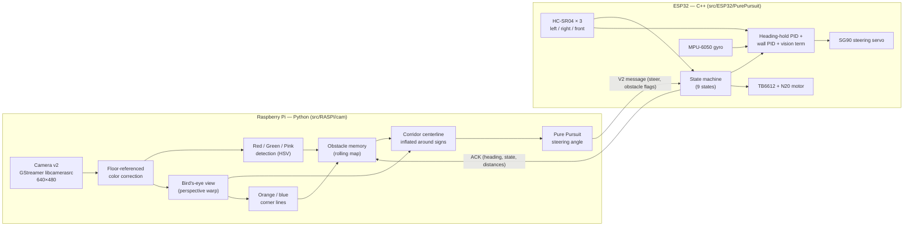
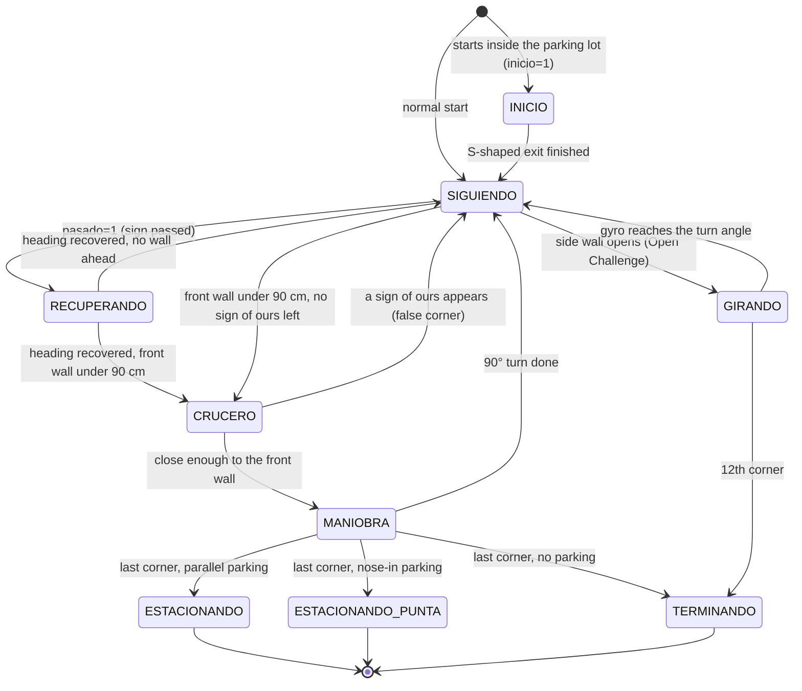

# WRO 2026 — Future Engineers | Self-Driving Car

> **Team:** FoxRobotics
> **| Members:** Erick Blanco · Jesse Banda · Cesar Ahumada
> **| Coach:** Daniel Millan
> **| Country / Region:** México — Baja California
> **| Season:** 2026

---

## Table of Contents

1. [Vehicle Overview](#1-vehicle-overview)
2. [Mechanical Design & Mobility](#2-mechanical-design--mobility)
3. [Power Architecture & Sensors](#3-power-architecture--sensors)
4. [Software Architecture](#4-software-architecture)
5. [Systemic Thinking & Engineering Decisions](#5-systemic-thinking--engineering-decisions)
6. [How to Build & Run](#6-how-to-build--run)
7. [Repository Structure](#7-repository-structure)
8. [Videos](#8-videos)
9. [Photos](#9-photos)

---

# 1. Vehicle Overview

Our vehicle is a custom-built autonomous car for the WRO 2026 Future Engineers — Self-Driving Cars challenge. It needs to complete 3 laps around a randomized track, detect and correctly pass colored traffic sign pillars (red on the right, green on the left), and park itself at the end of the Obstacle Challenge round.

**Key specifications:**

| Parameter | Value |
|---|---|
| Dimensions | 210 × 140 × 80 mm |
| Weight | 564 g |
| Drive type | Rear-wheel drive (RWD) |
| Steering | Rack-and-pinion, Ackermann geometry: 53° inner / 37° outer wheel at full lock (~106% Ackermann) |
| Main controller | Raspberry Pi 5 (16 GB) + official Active Cooler |
| Secondary controller | ESP32 (motor & sensor handling) |
| Vision | Raspberry Pi Camera v2 (FOV 62) |
| Distance sensors | HC-SR04(5V) x 2 (left, right) + Level Shifter 5V - 3.3V · VL53L1X ToF x 4 (in integration) |
| IMU | MPU-6050 (gyroscope + accelerometer) |
| Drive motor | N20 DC Motor  |
| Battery (motor) | 3S LiPo 11.1V 2200 mAh |
| Power | Step Down Mini560 5V - 5A |

### 1.1 What changed in v2 (October 2026)

After the national final we reworked the parts of the car that were limiting it. Each change has its own section with the numbers behind it.

| Area | v1 (national final) | v2 | Why | Details |
|---|---|---|---|---|
| Steering geometry | Anti-Ackermann: the outer wheel steered *more* than the inner one (39.5° inner / 42.8° outer) | Ackermann corrected: rack joints 43 → 47 mm apart, tie rods 18.13 mm | Both front wheels now roll around the same turning center instead of fighting each other | [2.4](#24-steering--rack-and-pinion-with-ackermann-geometry) |
| Steering pinion | Module 1, 14 teeth | Module 1, **19 teeth**; servo moved 2.5 mm away from the rack | Same servo travel moves the rack 36% further: ~37° → **53°** on the inner wheel (measured in CAD) | [2.4](#24-steering--rack-and-pinion-with-ackermann-geometry) |
| Main computer | Raspberry Pi 4 | **Raspberry Pi 5, 16 GB** + Active Cooler | The Pi 4 was compute-bound at 14–18 fps and hit thermal throttling at 84 °C; the Pi 5 runs the same pipeline at ~40 fps at 52 °C | [3.3](#33-main-computer--raspberry-pi-5) |
| Distance sensing | 2–3 HC-SR04 only | + 4 × **VL53L1X** ToF (front, left, right, rear) | The front ultrasonic produced phantom echoes in ~20% of straight-line frames; ToF gives a narrow beam and a rear sensor for reverse maneuvers | [3.2](#32-sensor-selection-and-placement) |

# Bill of Materials (BOM)

---

## Custom Manufactured Parts

| ID | Component | Description | Quantity | Supplier | Approximate Cost |
|---|---|---|---|---|---|
| 1 | BaseChasis | Main body of the vehicle. | 1 | Custom made, 3D printed | 1.6 USD |
| 2 | TopShell | Upper part of the vehicle. | 1 | Custom made, 3D printed | 1 USD |
| 3 | Cremallera | Rack used for steering. | 1 | Custom made, 3D printed | 0.1 USD |
| 4 | ServoGearDirection | Steering pinion (module 1, 19 teeth in v2), directly connected to the servo. | 1 | Custom made, 3D printed | 0.5 USD |
| 5 | LinkageDirection | Linkage between the rack and steering knuckle. | 2 | Custom made, 3D printed | 0.05 USD |
| 6 | SteeringKnuckle | Allows lateral wheel movement for steering. | 2 | Custom made, 3D printed | 0.15 USD |
| 7 | DCsupport | Holds the DC motor in place. | 1 | Custom made, 3D printed | 0.05 USD |
| 8 | RingDifferential | Main driven gear of the differential that transfers power to the axle assembly. | 1 | Custom made, 3D printed | 0.25 USD |
| 9 | PlanetDifferential | Allows torque distribution between both wheels while enabling different wheel speeds during turns. | 2 | Custom made, 3D printed | 0.1 USD |
| 10 | PinionDifferential | Transfers rotational motion from the motor to the differential gear system. | 1 | Custom made, 3D printed | 0.1 USD |
| 11 | SunDifferential | Transfers torque from the differential gears to the wheel axle. | 2 | Custom made, 3D printed | 0.1 USD |
| 12 | CameraBase | Holds the camera frame in place. | 1 | Custom made, 3D printed | 0.1 USD |
| 13 | CameraBack | Rear section of the camera frame. Connects to the CameraBase. | 1 | Custom made, 3D printed | 0.1 USD |
| 14 | CameraFront | Camera frame. | 1 | Custom made, 3D printed | 0.2 USD |
| 15 | UltrasonicSupport | Holds the ultrasonic sensor in place. | 2 | Custom made, 3D printed | 0.2 USD |

---

## LEGO Components

| ID | Component | Description | Quantity | Supplier | Approximate Cost |
|---|---|---|---|---|---|
| 16 | Lego 6135494 | Front wheel axle. | 2 | LEGO | 0.8 USD |
| 17 | Lego 4535768 | Rear wheel axle. | 2 | LEGO | 1 USD |
| 18 | Lego 6121485 | Reduces friction on the rear wheels. | 2 | LEGO | 0.4 USD |
| 19 | Lego 4299389 | Rim for rear wheels. | 2 | LEGO | 1.2 USD |
| 20 | Lego 4184286 | Tires for rear wheels. | 2 | LEGO | 3.5 USD |
| 21 | Lego 6251174 | Rim for front wheels. | 2 | LEGO | 1.2 USD |
| 22 | Lego 6182551 | Tires for front wheels. | 2 | LEGO | 3.82 USD |

---

## Electronics

| ID | Component | Description | Quantity | Supplier | Approximate Cost |
|---|---|---|---|---|---|
| 23 | ESP32 | Main microcontroller responsible for sensor processing, control algorithms, and overall robot operation. | 1 | Unit Electronics | 8 USD |
| 24 | Raspberry Pi 5 (16 GB) + Active Cooler + M.2 HAT+ | Processes computer vision tasks and handles high-level autonomous navigation functions. Replaced the Raspberry Pi 4 in v2 (price includes taxes and shipping). | 1 | Official reseller | 410 USD |
| 25 | Mini560 5V - 3A | Voltage regulator used to power the Raspberry Pi, ESP32, and peripherals. | 1 | Amazon | 6 USD |
| 26 | MPU 6050 | 6-axis IMU sensor used to measure acceleration, angular velocity, and robot orientation. | 1 | Unit Electronics | 3 USD |
| 27 | HC-SR04 | Ultrasonic distance sensor used for obstacle detection and distance measurement. | 2 | Unit Electronics | 7 USD |
| 28 | Level Shifter | Logic level converter used to safely interface devices operating at different voltage levels. | 1 | Unit Electronics | 7 USD |
| 29 | Driver TB6612FNG | Dual motor driver used to control the speed and direction of the DC motor. | 1 | Unit Electronics | 5 USD |
| 30 | RaspiCamera V2 | Camera module used for computer vision. | 1 | Amazon | 10 USD |
| 31 | Custom PCB | Printed circuit board used for power distribution and electronic connections. | 1 | JLCPCB | 5 USD |

---

## Power System

| ID | Component | Description | Quantity | Supplier | Approximate Cost |
|---|---|---|---|---|---|
| 32 | Ovonic 2200mAh 3S | 3-cell LiPo battery used to power the robot's electronic and drive systems. | 1 | E-Bay | 13 USD |

---

## Actuators

| ID | Component | Description | Quantity | Supplier | Approximate Cost |
|---|---|---|---|---|---|
| 33 | N20 with 50:1 reduction | DC gear motor with a 50:1 reduction ratio used to provide high torque for robot movement. | 1 | Unit Electronics | 6 USD |
| 34 | SG90 Servo | Micro servo motor used for steering control. | 1 | Unit Electronics | 6 USD |

---

## Fasteners

| ID | Component | Description | Quantity | Supplier | Approximate Cost |
|---|---|---|---|---|---|
| 35 | M3 Screws | Used for structural assembly and component mounting. | 23 | Local Hardware Store | 1 USD |
| 36 | M3 Nuts | Used to secure structural and electronic components. | 1 | Local Hardware Store | 0.05 USD |
| 37 | M2 Nuts | Used to secure servo motor and servo pinion | 3 | Local Hardware Store | 0.15 USD |

## Total Estimated Cost

| Total |
|---|
| ~501 USD |


---

# 2. Mechanical Design & Mobility

### 2.1 Chassis selection

The chassis was designed from scratch to fit all the components we needed for competition. We printed it in red and black SUNLU PLA on a Bambu Lab A1, keeping the structure as light as possible without sacrificing the rigidity the drivetrain and electronics require.

For wheel transmission shafts, we used LEGO axles throughout: part 6135494 for the front and part 4535768 for the rear. This wasn't an aesthetic choice — LEGO axles have much better dimensional consistency than fully printed shafts, which flex under load and cause alignment issues. We also added LEGO bushings (6121485) to the rear axle to cut down on friction between moving parts.

| Component   | Material / Part | Purpose                 |
| ----------- | --------------- | ----------------------- |
| Chassis     | SUNLU PLA       | Main robot structure    |
| Front Axles | LEGO 6135494    | Power transmission      |
| Rear Axles  | LEGO 4535768    | Rear drivetrain support |
| Bushings    | LEGO 6121485    | Friction reduction      |
| Printer     | Bambu Lab A1    | Manufacturing process   |

We used PLA because it prints fast, doesn't warp like ABS, and is stiff enough for indoor competition conditions. PETG has better impact resistance and ABS handles heat better, but neither of those properties matters much for a robot running on a flat mat indoors. What did matter was being able to iterate quickly and get consistent parts, and PLA delivered on both.

### 2.2 Wheels

We tested several wheel options before settling on LEGO parts. The rear wheels use rim 4299389 with tire 4184286, and the front uses rim 6251174 with tire 6182551. Both have a 43 mm outer diameter, which keeps the ride height even front to rear.

Since the drivetrain already uses LEGO axles, LEGO-compatible rims were the obvious fit — they mount directly without adapters, which removes a potential source of wobble at the wheel interface.

The 43 mm diameter was also validated against our motor RPM target. At our gear ratio, this diameter puts normal operation in the 40–70% PWM range, which gives us enough resolution for smooth speed control. A noticeably larger wheel would push operating duty cycles above 85% and compress the usable throttle range.

We ran the car at full throttle on the competition mat surface and saw no detectable slip at the rear. The LEGO rubber compound grips the white matte WRO field without any prep needed.

### 2.3 Drive system (torque vs. speed analysis)

The main drive is an N20 DC motor with a 50:1 internal gearbox — compact at 12 × 10 × 26 mm and still enough torque for a ~1.5 kg vehicle. Between the motor output shaft and the differential, we added a 2:1 LEGO gear stage, bringing the total drivetrain reduction to **100:1** and estimated rear axle torque to about 1.76 kg·cm.

**Why 100:1 and not just 50:1?**

We ran the 50:1 configuration first. It was faster, but corner exits were inconsistent — the rear wheels would occasionally lose traction under acceleration, causing yaw disturbances the PID couldn't fully catch. At 100:1, top speed dropped but torque delivery became smooth and predictable all the way through the speed range. Corner exits became repeatable, which turned out to be a prerequisite for reliable PID tuning.

The ratio also keeps the motor in its efficient RPM band during most of the run, which matters because the motor shares a power rail with the ESP32 logic.

The car completes all three Open Challenge laps in about 12 seconds at just 60% motor speed. That headroom is useful if we need to push speed in later iterations.

**The takeaway:** we prioritized consistency over raw speed. A robot that reliably finishes 3 laps scores more than one that's faster but unpredictable.

### 2.4 Steering — rack-and-pinion with Ackermann geometry

Steering is driven by an SG90 servo that turns a pinion on a rack. The rack pushes both front knuckles through two symmetric tie rods (linkages). In v2 we redesigned this mechanism because of two problems: the geometry was **anti-Ackermann**, and the car **could not turn tightly enough**.

**Geometry reference** (top view, wheels straight, measured in SolidWorks):

| Parameter | Value |
|---|---|
| Kingpin track T (distance between the two knuckle pivots) | 60 mm |
| Wheelbase L (front kingpin line → rear axle) | 112.85 mm |
| Knuckle steering arm (pivot → tie-rod joint) | 12.49 mm, pointing ~43° outward and backward |
| Rack joints behind the kingpin line | 18.94 mm |
| Servo swing actually used | ±71° (measured from the rack travel, not the nominal ±90°) |

#### Problem 1 — anti-Ackermann (fixed)

In a turn, the inner wheel follows a smaller circle than the outer wheel, so it must steer **more**. Correct (100%) Ackermann is reached when

  **cot(δ_outer) − cot(δ_inner) = T / L = 0.532**

and the axis lines of both front wheels cross on the rear axle line.

In v1 the rack joints were only 28.5 mm apart with 26 mm tie rods. We simulated the linkage in Python with the exact CAD dimensions, and the model matched the CAD within ~1°. At full travel the car steered **39.5° on the inner wheel and 42.8° on the outer wheel**: the outer wheel was steering *more* than the inner one. The two front wheels were trying to turn around different centers, so one of them always dragged sideways. That cost traction and current in every corner, and the car turned wider than the servo command implied.

Because the knuckles had to stay as they were (a new knuckle means a new arm, and the rack position is fixed by the chassis), we only changed **the spacing between the rack joints** and **the tie-rod length**. Those two values must change together: for the wheels to point straight with the rack centered, the tie rod must be

  **linkage = √( (38.66 − spacing/2)² + 9.94² )**  (mm, center to center)

| Rack joint spacing | Tie rod | Ackermann at 30° | 40° | 45° | 50° | 55° |
|---|---|---|---|---|---|---|
| 28.5 (v1) | 26.0 | anti-Ackermann | | | | |
| 43.0 (intermediate) | 19.83 | 51% | 62% | 69% | 76% | 84% |
| **47.0 (v2)** | **18.13** | 76% | **89%** | **95%** | **102%** | 110% |
| 50.0 | 16.89 | 99% | 111% | 117% | 124% | 131% |

*(Percentage = how much of the ideal inner/outer difference the linkage achieves. Below 100% the outer wheel steers slightly too much; above 100% it steers too little.)*

**Why 47 mm:** with a fixed knuckle, Ackermann cannot be exact over the whole range, because the percentage grows as the wheels turn. We chose the spacing that is closest to 100% in the 40°–50° range, which is where the car actually turns at corners and during parking. At small angles the error is under 0.7°, so it does not matter there. Each 0.1 mm of tie-rod error toes a wheel by ~0.5°, so the printed linkages are trimmed in 0.05–0.1 mm steps until the wheels are straight.

#### Problem 2 — turning radius (bigger pinion)

The steering angle depends almost only on **how far the rack moves**, and with the v1 pinion that was **±8.7 mm**: only ~37° on the inner wheel. We looked at three options: shorter knuckle arms, moving the rack, and a bigger pinion. The bigger pinion was the only one that needed no new chassis or knuckles.

| | v1 | **v2** |
|---|---|---|
| Pinion | Module 1, 14 teeth | **Module 1, 19 teeth** (20° pressure angle) |
| Pitch / outer diameter | 14 / 16 mm | **19 / 21 mm** |
| Rack travel per servo degree | 0.122 mm/° | **0.166 mm/°** |
| Rack travel at ±71° servo | ±8.7 mm | **±11.8 mm** |
| Inner / outer wheel at full lock | ~37° / ~32° (with 43 mm spacing) | **53.1° / 37.0°** (measured in the CAD assembly; the linkage model predicted ~50° / ~37°) |
| Turning radius at the rear-axle center (L / tan δ_inner + T/2) | ~167 mm (v1 at 39.5°) | **~115 mm** (−31%) |
| Ackermann at full lock | anti-Ackermann | **~106%** (ideal outer for 53.1° inner = 37.9°, measured 37.0°) |

- **Servo position.** The pitch radius grows from 7 to 9.5 mm, so the servo axis moved **2.5 mm away from the rack** with a spacer on its mount. The rack and the tie-rod joints stay at the same height, so the linkage geometry above is not affected.
- **Pinion profile.** We generated the involute tooth profile with our own script ([`Mecanica/Engranes/gen_pinon.py`](Mecanica/Engranes/gen_pinon.py)) and exported it as a single closed DXF contour that we extrude in SolidWorks. It includes 0.10 mm of backlash for 3D printing.
- **Toggle limit.** The linkage would lock (arm and tie rod aligned) at around 16 mm of rack travel. If the servo ever reached a true ±90°, the 19-tooth pinion could push the rack to ±14.9 mm. The intended mechanical stop is the knuckle touching the chassis before that point, and the servo output is also clamped in software.
- **Servo load.** The bigger pinion needs ~1.36× more servo torque for the same rack force. It also loses some angular resolution, which is still fine for an SG90 in a 0.5 kg car. The servo must not be left stalled against the stop, because it heats up and drags down the 5 V rail.

**Servo calibration.** The servo-to-wheel relation is no longer linear: near full lock the wheels turn faster per servo degree. The servo map and the steering gains in the ESP32 firmware are recalibrated on the assembled car (pending).

**Why rack-and-pinion over a direct servo arm?**

A direct arm only controls one wheel directly. The opposite knuckle, linked by a fixed-length tie rod, gets an angle that's geometrically correct only at center, producing toe error everywhere else. The rack pushes both tie rods symmetrically. With the correct joint spacing and tie-rod length it lets us tune the Ackermann percentage without touching the servo or the knuckles, which is exactly what made the v2 fix possible with only three reprinted parts (rack, two linkages) plus the pinion.

---

# 3. Power Architecture & Sensors

### 3.1 Power budget

The whole vehicle runs off an Ovonic 2200mAh 3S LiPo. Power splits two ways: the motor driver takes battery voltage directly for the DC motor, and everything else goes through a MINI560 step-down converter producing a stable 5V at up to 5A.

| Rail | Source | Consumers | Max Current Draw |
|---|---|---|---|
| 5V Logic | MINI560 Step-Down Converter | Raspberry Pi 4 Model B + RaspiCam V2, ESP32, HC-SR04, MPU6050, sg90 | ~4.0 A |
| Battery / Main Power | Ovonic 2200mAh 3S LiPo | Entire vehicle power distribution | ~35 A discharge capability |
| Motor Power | Motor Driver directly from 3S LiPo | DC drive motor | ~1.6 A peak |
| 3.3V Internal | ESP32 internal regulator | I²C communication and internal ESP32 logic, Level Shifter | ~200 mA |

The Ovonic battery is rated 120C continuous, which is theoretically 264 A. We're drawing about 4.5 A peak — under 2% of its discharge capability. There's no shortage of headroom here.

**v2 power change (Raspberry Pi 5).** The Pi 5 draws more than the Pi 4 and is sensitive to voltage drops: when its supply sags, it throttles the CPU, which directly lowers the vision frame rate. We already saw this on the Pi 4 when it was fed through Dupont jumpers (`throttled=0x50005`, CPU down to 600 MHz); replacing them with 22 AWG wire fixed it. For v2 the plan is **two Mini560 regulators: one dedicated to the Pi 5** and one for the ESP32, servo and sensors, so servo current spikes can't pull the Pi's rail down. The motor driver stays on raw battery voltage. `vcgencmd get_throttled` must read `0x0` under full load before every test session.

### 3.2 Sensor selection and placement

| Sensor | Purpose | Placement | Notes |
|---|---|---|---|
| Raspberry Pi Camera Module V2 | Lane and obstacle detection | Front-center, 15° downward tilt | Main vision system using OpenCV |
| HC-SR04 ×2 | Wall distance measurement | Left and right sides of the vehicle | Filtered readings for stable navigation |
| MPU-6050 | Heading and turn estimation | Center of chassis | Used for orientation correction |
| VL53L1X ToF ×4 *(v2, in integration)* | Short-range distance with a narrow beam | Front, left, right and rear | Complements the HC-SR04, which stay as a backup |

#### Camera System (Raspberry Pi Camera V2 with wide-angle lens)

The camera handles lane detection, traffic sign identification, and colored pillar detection. Image processing runs on the Raspberry Pi 4 using OpenCV in real time.

It's mounted at the front-center with a 15° downward tilt. We tested horizontal mounting first, but that captured too much background, slowing detection and generating noise. Tilting it down focused the field of view on the track and obstacle zones, cutting both false positives and computational load.

#### HC-SR04 ultrasonic sensors

Two HC-SR04s measure distance to the surrounding walls. They drive lateral positioning, wall following, and corner navigation.

We originally tested VL53L0X time-of-flight sensors. On paper they win — ±3 mm accuracy versus ±15 mm for the HC-SR04, and a narrower beam. In practice, the black competition walls absorbed their 940 nm IR signal and consistently returned out-of-range readings at 300 mm. The HC-SR04 reflects off any surface regardless of color. We went with reliability over precision and made up the accuracy difference with software filtering.

Both sensors are mounted on opposite sides of the chassis. Readings are averaged and invalid values rejected before they reach the PID.

#### MPU-6050 IMU

The MPU-6050 gives us heading and rotation data during cornering and fast maneuvers. The gyroscope estimates the robot's heading and feeds the inner PID loop, complementing what the camera sees.

On startup, the IMU averages multiple readings while the robot is stationary to calculate gyroscope bias. That offset is subtracted throughout the run, which cuts drift and keeps angular estimation accurate over the course of three laps.

#### VL53L1X time-of-flight array (v2, in integration)

**Why we are adding ToF again.** In v1 we dropped the VL53L0X because it lost the black walls (see [Trade-off 1](#52-key-engineering-trade-offs)). We are revisiting ToF because of a measured problem with the ultrasonics. In the Open Challenge logs, the front HC-SR04 reported a wall closer than 90 cm in **~20% of the frames on straight sections** where there was no wall. These readings jump more than 60 cm from one frame to the next (e.g. 199 → 65 → 179 cm), which no real wall can do. Each phantom made the car slow down in the middle of a straight. The phantoms only appear when the car runs ~25 cm from the side wall, which points to the wide ultrasonic cone grazing that wall. A ToF sensor has a much narrower field of view, so it should not see the side wall.

**Why the VL53L1X and not the VL53L0X.** It has a longer range (up to ~4 m in long mode on bright targets), a configurable timing budget and a configurable region of interest. Teams that tested it against the WRO black wall reported usable readings up to about 80–100 cm. That makes it a **near-field** sensor; the HC-SR04 stay for long range and as an independent check.

**Layout:**

| Sensor | Position | Use | XSHUT pin (ESP32) | I²C address |
|---|---|---|---|---|
| Front | Front bumper | Distance to the wall ahead (corner trigger, approach speed) without side-wall phantoms | GPIO 0 | 0x30 |
| Left | Left side | Distance to the side wall | GPIO 15 | 0x31 |
| Right | Right side | Distance to the side wall | GPIO 5 | 0x32 |
| Rear | Rear bumper | Reverse maneuvers: leaving the parking lot, reverse pivots and parking, which are blind today | GPIO 4 | 0x33 |

All four share the I²C bus (SDA 21, SCL 22). They all start at the same factory address (0x29), so at boot the ESP32 holds every sensor off with its XSHUT pin, then powers them one by one and gives each a new address. They run in long-distance mode with a 50 ms timing budget. Test sketches are in `src/ESP32/TofTest4/` (4 sensors), `src/ESP32/TofId/` (tells an L0X from an L1X) and `src/ESP32/TofBnoTest/`. The last one also reads a **BNO085** IMU in UART-RVC mode, which we are evaluating as a replacement for the MPU-6050 (on-chip sensor fusion, less heading drift).

**Integration plan.** First on the bench against a real black wall, varying distance, wall angle and mounting height. Then **log-only** on the car, recorded next to the HC-SR04 values for several runs. The firmware will only use them for control after the logs show they are reliable. The ultrasonics remain as a backup in every case.

### 3.3 Main computer — Raspberry Pi 5

**Why we upgraded.** We profiled the Pi 4 running the real race code. The main Python thread was using **97% of one core**, and the loop ran at **14–18 fps** depending on the scene. Most of that time was spent on vision, not on the camera: ~5 ms capture, 17–22 ms color detection, 45–48 ms bird's-eye view and centerline. With the remote desktop client running, the Pi 4 also reached **84 °C** and entered thermal throttling. A faster CPU attacks every stage at once.

**Measured result.** We ran the unmodified race runtime on the Pi 5, replaying a recorded Obstacle Challenge run as the camera input at 30 fps:

| | Raspberry Pi 4 | Raspberry Pi 5 (16 GB) |
|---|---|---|
| Vision loop rate | ~15.5 fps (same run, recorded live) | **40–41.5 fps**, stable for 60 s |
| Time per frame | ~65 ms | ~25 ms |
| Temperature | up to 84 °C, throttled | 46 → 52 °C, no throttling (`0x0`) |

The Pi 5 also has the official **Active Cooler**. Its fan is controlled by the firmware: it stays off below 50 °C and speeds up in steps up to 100% at 75 °C. The **M.2 HAT+** is installed for a future NVMe SSD, which will mainly make storage more durable when recording a video of every run.

**What the port required:**
- **Per-frame constants.** Many filters and confirmations in the runtime count *frames* and were tuned at ~14 fps. At 40 fps they would run almost 3× faster in real time. The loop also doesn't wait for a new camera frame. Before racing on the Pi 5 we either cap the loop at the old rate or rescale those constants.
- **Serial port.** On the Pi 5, `/dev/serial0` points to the debug UART connector, not to the GPIO header. The ESP32 link uses `/dev/ttyAMA0` (GPIO 14/15).
- **GPIO.** The original `RPi.GPIO` library does not support the Pi 5, so we use the drop-in `rpi-lgpio` package and the code stays the same.
- **Camera.** The Pi 5 uses the smaller 22-pin camera connector, so the Camera v2 needs a 22-to-15-pin cable.
- **OpenCV.** It must be the system package (`python3-opencv`), because the pip wheel is built without the GStreamer backend that the `libcamerasrc` capture pipeline needs.

---

## 4. Software Architecture

### 4.1 System overview

The software is split across two processors by what each one does best. The **Raspberry Pi** does everything that needs a camera and a lot of computation: it sees the track, the traffic signs and the corner lines, and decides *where* the car should go. The **ESP32** does everything that needs exact timing: it reads the IMU and ultrasonic sensors, runs the state machine, and drives the servo and the motor. They talk over a 115200-baud UART, one message per processed frame.


```mermaid
flowchart LR
    subgraph PI["Raspberry Pi — Python (src/RASPI/cam)"]
        CAM["Camera v2<br/>GStreamer libcamerasrc<br/>640×480"] --> CC["Floor-referenced<br/>color correction"]
        CC --> DET["Red / Green / Pink<br/>detection (HSV)"]
        CC --> BEV["Bird's-eye view<br/>(perspective warp)"]
        BEV --> CL["Corridor centerline<br/>inflated around signs"]
        BEV --> LINES["Orange / blue<br/>corner lines"]
        DET --> MEM["Obstacle memory<br/>(rolling map)"]
        LINES --> MEM
        MEM --> CL
        CL --> PP["Pure Pursuit<br/>steering angle"]
    end
    subgraph ESP["ESP32 — C++ (src/ESP32/PurePursuit)"]
        FSM["State machine<br/>(9 states)"] --> CTRL["Heading-hold PID +<br/>wall PID + vision term"]
        IMU["MPU-6050 gyro"] --> CTRL
        US["HC-SR04 × 3<br/>left / right / front"] --> FSM
        US --> CTRL
        CTRL --> SERVO["SG90 steering servo"]
        FSM --> MOTOR["TB6612 + N20 motor"]
    end
    PP -- "V2 message (steer, obstacle flags)" --> FSM
    FSM -- "ACK (heading, state, distances)" --> MEM
```

The ESP32 never waits for the Pi. If no message arrives for **800 ms** (`piTimeoutMs`), it falls back to wall-following with the gyro, so a vision hiccup degrades the run instead of stopping it.

| Responsibility | Runs on | Why there |
|---|---|---|
| Camera capture, color detection, bird's-eye view, path planning | Raspberry Pi | Needs a full CPU core and the CSI camera interface |
| Remembering obstacles that left the camera view | Raspberry Pi | Needs the 2D map in bird's-eye coordinates |
| Gyro integration, ultrasonic reads | ESP32 | Needs µs-level timing and a steady loop rate |
| State machine, corner maneuvers, start and parking | ESP32 | Must keep running even if the Pi stalls |
| Servo and motor PWM | ESP32 | Hardware PWM, no Linux scheduling jitter |

### 4.2 Raspberry Pi vision pipeline

The entry point is [`src/RASPI/cam/pure_pursuit/runtime_nuevo.py`](src/RASPI/cam/pure_pursuit/runtime_nuevo.py), started at boot by `deploy/systemd/wro-runtime.service`. Each processed frame goes through these stages:

| # | Stage | Module | What it does |
|---|---|---|---|
| 1 | Capture | `vision.py`, `wro_runtime.py` | GStreamer `libcamerasrc` pipeline, 1640×1232 sensor mode scaled to 640×480. A separate thread always keeps only the newest frame, so the loop never processes a stale one. |
| 2 | Color correction | `color_corr.py` | Software white balance referenced to the white floor, so the red/green thresholds survive a change of venue lighting. |
| 3 | Sign detection | `vision.py` | HSV masks for the red and green signs, plus the magenta parking-lot walls. Each blob becomes a box with color, position and size. |
| 4 | Bird's-eye view | `bev.py` | Perspective warp (inverse perspective mapping) of the floor, calibrated once with floor marks (`calibrate.py`). In this view 1 px ≈ 2 mm, so distances and angles can be measured directly. |
| 5 | Corner lines | `corner_lines.py` | Finds the orange and blue lines on the floor. They tell the car where the corner is, the direction of travel, and whether a sign belongs to *this* straight or to the next one. |
| 6 | Obstacle memory | `obstacle_memory.py` | Keeps each sign in a rolling 2D map after it leaves the camera view. Every frame the map is moved by the assumed speed and rotated by the gyro heading change that the ESP32 sends back. |
| 7 | Centerline | `centerline.py` | Finds the free corridor between the walls and pushes it around every sign on the correct side: red signs are passed on the right and green signs on the left. |
| 8 | Pure Pursuit | `controller.py` | Picks a point on that path at the look-ahead distance (78–100 px, shorter when a sign is close) and computes the steering angle that reaches it on a circular arc. A slew limit (6° per frame) prevents jerks. |
| 9 | Message and log | `runtime_nuevo.py` | Sends the V2 message, logs it, and records the camera + bird's-eye view to a video file (`videos_orillas/orillasNNN.avi`) that we review after every test run. |

**Why Pure Pursuit on a bird's-eye view, and not a PID on the image offset?** In the raw camera image, a sign 1 m away and a sign 20 cm away move the same number of pixels for very different real distances, so a gain tuned for one is wrong for the other. In the bird's-eye view, pixels are millimeters, and Pure Pursuit turns a target point into a steering angle with the car's real geometry. The same code then handles straights, dodges and the exit of a corner.

**Hot start.** As soon as the Pi boots, the whole pipeline runs **disarmed**: it detects, maps and records, but sends nothing to the ESP32. When the start button is pressed, the first sign is already tracked and the steering is already ramped, so the car reacts from the very first frame instead of spending its first 10–15 cm initializing.

### 4.3 Pi ↔ ESP32 protocol

One line per processed frame, Pi → ESP32:

```
V2,obs=+0.515,turn=0,state=pp_follow,prio=1,mem=1,pp=1,pasado=0,intr=0,inicio=0,park=0,pd=0
```

| Field | Meaning |
|---|---|
| `obs` | Pure Pursuit steering angle, normalized (`steer_deg / 60`) |
| `prio`, `mem` | There is a sign that belongs to this straight: in view (`prio`), or only in memory (`mem` = frames left) |
| `pasado` | Single event, held for 6 frames: "the sign we were dodging is now beside or behind us". The ESP32 then returns to its original heading. |
| `intr` | The current sign is passed on the same side the track turns, so the coming turn itself completes the pass |
| `inicio` | The car starts inside the parking lot, so it must drive out of it first |
| `park`, `pd` | Parking-lot search state and distance |

The ESP32 answers each line with an ACK:

```
ACK:V2,ang=-3.2,est=S,dir=L,dL=31,dR=48,dF=142,...
```

`ang` (gyro heading) feeds the obstacle memory. `est` (state) tells the Pi when a turn starts, so it clears the memory for the next straight. `dir` (direction of travel) is latched at the first corner. The ACK also carries the filtered ultrasonic distances and the internal controller values. The Pi logs every ACK to `journalctl`, which is how we debug runs afterwards (see [testing](docs/testing.md)).

### 4.4 ESP32 state machine

[`PurePursuit.ino`](src/ESP32/PurePursuit/PurePursuit.ino) runs a nine-state machine. The Open and Obstacle challenges share it; the compile-time flag `rondaObstaculos` selects which corner strategy runs.


```mermaid
stateDiagram-v2
    [*] --> INICIO: starts inside the parking lot (inicio=1)
    [*] --> SIGUIENDO: normal start
    INICIO --> SIGUIENDO: S-shaped exit finished
    SIGUIENDO --> RECUPERANDO: pasado=1 (sign passed)
    RECUPERANDO --> SIGUIENDO: heading recovered, no wall ahead
    RECUPERANDO --> CRUCERO: heading recovered, front wall under 90 cm
    SIGUIENDO --> CRUCERO: front wall under 90 cm, no sign of ours left
    CRUCERO --> SIGUIENDO: a sign of ours appears (false corner)
    CRUCERO --> MANIOBRA: close enough to the front wall
    MANIOBRA --> SIGUIENDO: 90° turn done
    SIGUIENDO --> GIRANDO: side wall opens (Open Challenge)
    GIRANDO --> SIGUIENDO: gyro reaches the turn angle
    MANIOBRA --> ESTACIONANDO: last corner, parallel parking
    MANIOBRA --> ESTACIONANDO_PUNTA: last corner, nose-in parking
    MANIOBRA --> TERMINANDO: last corner, no parking
    GIRANDO --> TERMINANDO: 12th corner
    ESTACIONANDO --> [*]
    ESTACIONANDO_PUNTA --> [*]
    TERMINANDO --> [*]
```

| State | Purpose | Steering | Why it exists |
|---|---|---|---|
| `INICIO` | Drive out of the parking lot with a fixed S-shaped maneuver | Open-loop, gyro-checked | The Obstacle Challenge may start inside the lot. The Pi detects it from the share of magenta in the first frames. |
| `SIGUIENDO` | Drive a straight | **Gyro heading-hold** + wall PID + small vision centering term. Pure Pursuit takes over **only while a sign of ours is present**. | A clean straight is driven by the gyro, which never drifts with lighting. Vision steers only when it has something to dodge. |
| `RECUPERANDO` | Return to the heading the car had before the dodge | Gyro only | After passing a sign, the camera may already see the *next* one while the chassis is still turned. This state cannot be interrupted until the car is straight again. |
| `CRUCERO` | Approach the corner | Vision far away, gyro + walls when < 90 cm from the front wall | Near the corner, the vision centerline starts to bend towards the front wall, so it would make the chassis crooked. |
| `MANIOBRA` | Stop-and-turn at a corner (Obstacle Challenge) | Forward arc or reverse pivot, gyro-gated | See [4.6](#46-corner-strategy). |
| `GIRANDO` | Continuous turn (Open Challenge) | Fixed full lock, speed ramp | No signs in the Open Challenge, so a fast continuous turn is safe. |
| `ESTACIONANDO` | Parallel parking in reverse | Wall-referenced heading | 15-point parking |
| `ESTACIONANDO_PUNTA` | Nose-in partial parking | Gyro + outer wall | A simpler fallback parking mode |
| `TERMINANDO` | Stop in the finish section | — | Used when parking is disabled |

**Why the gyro, and not the camera, drives the straights.** Our first versions let vision steer all the time. Every small dodge left the chassis 20–30° crooked, and the car slowly drifted towards a wall (runs 679–700). Making gyro heading-hold the default, and using vision only to dodge, fixed the drift. After that change, run 700 was the first clean 12-corner run.

### 4.5 Obstacle strategy

1. **Is this sign ours?** A sign is only dodged if it belongs to the straight we are driving on. When the corner line is visible, a sign beyond it belongs to the next straight. The classification must hold for several frames before it is accepted (6 frames to become "ours", 12 to become "beyond") so one noisy frame can't flip it.
2. **Dodge.** The sign is drawn into the bird's-eye view as a circle of ~35 px (≈70 mm, sign plus safety margin). The centerline is pushed around it on the side the rules require. Pure Pursuit follows the new path, with a shorter look-ahead when the sign is close.
3. **Remember it.** When the sign leaves the camera view (it is too close, or below the image), the obstacle memory keeps moving it with the car's motion. The path keeps avoiding it, so the car doesn't straighten too early and clip it.
4. **Detect "passed".** The Pi sends `pasado=1` when all three hold: (a) the path really bent (a real dodge, not a 2° wiggle), (b) no remembered sign is still ahead within the car's width, and (c) the chassis has turned ≥ 15° from where the dodge started. The ESP32 then enters `RECUPERANDO`.
5. **Edge cases we handle explicitly:**
   - A sign at the mouth of the next straight seen during the approach: it is ignored until after the turn.
   - Two consecutive signs of different colors (slalom): the dodge switches sides.
   - A sign that reappears after a turn: it is merged with its remembered copy instead of being counted twice.
   - The pink parking-lot walls and the orange tape were being detected as red: tighter hue limit plus a green/red ratio test.
   - Sudden camera blackouts (CSI noise): the frame brightness is checked and the camera is reopened before the run starts.

   Each of these came from a specific failed test run. They are logged with the run number in the [engineering log](docs/engineering-log.md).

### 4.6 Corner strategy

| | Open Challenge (`GIRANDO`) | Obstacle Challenge (`CRUCERO` → `MANIOBRA`) |
|---|---|---|
| Trigger | A side ultrasonic reads > 100 cm (the wall opens) | The front ultrasonic is close to the wall ahead, with a debounce |
| Execution | Full steering lock, motor ramp 145 → 135 → 115 PWM, until the gyro reaches 76° | Stop. Then a **forward arc** if the car is close to the outer wall, or a **reverse pivot** if it is near the inner wall or centered. Gyro-gated to 90°. |
| Why | Fast, and safe with no signs | It always starts the next straight from the same place. A forward arc from the inner side would skip a sign at the mouth of the next straight. |

The direction of travel (CW/CCW) is decided at the first corner by which side opens, and then latched for the whole run.

**Why stop-and-turn instead of a continuous turn in the Obstacle Challenge?** It is slower, but it removed the most common failure we had: hitting or skipping the sign at the mouth of the next straight. Two weeks before the national final we chose **points over time**, because the score counts first and time only breaks ties. We may bring back continuous turns for laps 2–3, where the layout of the signs is already known, once the rest of the run is reliable.

### 4.7 Start and parking

- **Start in the lot.** While disarmed, the Pi measures the share of magenta in the frame. When the button is pressed it decides once whether the car is inside the parking lot, and sends `inicio=1` if so. The ESP32 then runs `INICIO`: it swings out of the lot, drives straight, counter-steers back to the track heading, and backs up briefly to square up before the first straight.
- **Parking.** After the last corner the car follows the outer wall. It detects the lot from the side ultrasonic profile (wall → gap → wall), and the camera confirms the magenta walls. Then it parks **in reverse** in `ESTACIONANDO`. During parking, the heading reference is re-measured against the wall to cancel the gyro drift collected over 3 laps (`PARK_TRIM_*`). Runs 1025, 1052 and 1064 produced perfect parallel parks, and we keep their constants as the reference set.

### 4.8 Low-level control — wall + heading cascade PID

*This controller was the whole software in v1 (Open Challenge only). It is still the base layer on the ESP32: it drives the Open Challenge, and the Obstacle Challenge uses it for heading-hold on clean straights and as the fallback when the Pi is silent.*


**The problem with a single-loop PID:**

The original controller used a single error signal:

```cpp
error = distL - distR
```

This worked fine when the vehicle was parallel to the walls. Past about 30° of yaw, the HC-SR04's conical beam hit the wall at an oblique angle. Both sensors simultaneously over-reported their distances, so `distL - distR` sat near zero even as the vehicle drifted toward a wall. The controller saw no error and did nothing — causing wall contacts in roughly 30% of test runs.

**The solution — cascade architecture:**

```
                ┌────────────────────┐   heading    ┌────────────────────┐
  distL─distR ─►│     OUTER PID      │─ setpoint ──►│     INNER PID      │──► servo
                │   (wall centering) │              │  (heading control) │
                └────────────────────┘              └────────────────────┘
                         ▲                                    ▲
                  HC-SR04 readings                    MPU-6050 yaw
```

The outer PID produces a target heading from the lateral wall error. The inner PID drives the servo to that heading using the IMU, which doesn't care about wall color or beam geometry and stays accurate at any vehicle angle.

```cpp
// OUTER PID — wall centering
errorWall    = constrain((float)(distL - distR), -50.0f, 50.0f);
integralWall += errorWall * dt;
float derivWall  = (errorWall - prevErrorWall) / dt;
float outputWall = KpWall * errorWall + KiWall * integralWall
                 + KdWall * derivWall;

// INNER PID — heading control  
errorGyro    = anguloObjetivo - anguloGyro;
float derivGyro  = (errorGyro - prevErrorGyro) / dt;
float outputGyro = KpGyro * errorGyro + KiGyro * integralGyro
                 + KdGyro * derivGyro;

// Combined output → servo
float output = constrain(outputWall + outputGyro, -45.0f, 45.0f);
escribirServo(centroServo + (int)output);
```

**Tuned gains:**

| Parameter | Value | Rationale |
|---|---|---|
| KpWall | 1.0 | Outer proportional |
| KiWall | 0.0 | Disabled — integral windup caused overshoot at corners |
| KdWall | 1.35 | Dampens lateral oscillation (1.2 in v1) |
| KpGyro | 2.0 | Inner proportional |
| KiGyro | 0.0 | Disabled |
| KdGyro | 0.5 | Dampens heading oscillation |

**Why no integral terms?**

With Ki enabled, the integral built up error during straight sections. At corner entry, the stored value produced a large steering impulse that overcorrected toward the opposite wall. Removing Ki from both loops fixed this entirely. The derivative terms provide enough steady-state correction on their own.

### 4.9 Sensor filtering — exponential moving average

Raw HC-SR04 readings spike occasionally from floor reflections in curved sections. An EMA filter smooths them before they reach the PID:

```cpp
float filtroEMA(float nueva, float anterior) {
    return alpha * nueva + (1 - alpha) * anterior;  // alpha = 0.85 (0.75 in v1)
}
```

Alpha = 0.85 (raised from 0.75 in v1) weights recent readings heavily for fast response to genuine wall changes while still killing single spike values. We tested down to 0.3; anything below 0.5 introduced lag that slowed the outer PID's reaction to real lateral drift.

### 4.10 Open Challenge corner — progressive speed ramp

During a corner, speed drops in steps as IMU yaw accumulates:

```cpp
if      (delta < 45) velocidadMotor = 145;
else if (delta < 70) velocidadMotor = 135;
else                 velocidadMotor = 115;   // first corner: VEL_INICIAL for the whole arc
```

This gives better positioning accuracy at corner exit. Once `|anguloGyro| >= 76°` (`ANG_GIRO_CERRADA`; the car keeps rotating a few degrees while the servo re-centers), the servo returns to center and `anguloObjetivo` updates to anchor the inner PID to the new straight heading.

### 4.11 IMU heading integration

Yaw is computed by integrating the MPU-6050 Z-axis each loop iteration:

```cpp
float gyroZ = mpu.getGyroZ();
if (abs(gyroZ) < 1.0) gyroZ = 0;   // 1°/s deadband suppresses drift
anguloGyro += gyroZ * dt;
```

The 1°/s deadband prevents MEMS thermal noise from accumulating into the integrated heading during straight travel. Without it, the inner PID applies a constant small steering offset to correct phantom heading drift, which slowly degrades straight-line tracking.

### 4.12 Development status

| Module | Status (October 2026) |
|---|---|
| Open Challenge: wall + gyro following, continuous corners | Raced at the national final |
| Obstacle Challenge: vision, obstacle memory, Pure Pursuit dodge | Raced at the national final |
| Stop-and-turn corners (`CRUCERO` → `MANIOBRA`) | Raced at the national final |
| Start from the parking lot (`INICIO`) | Raced at the national final |
| Parallel parking (`ESTACIONANDO`) | Working in testing (perfect parks in runs 1025, 1052 and 1064) |
| Port to Raspberry Pi 5 | In progress: pipeline validated on recorded video, frame-rate tuning pending |
| VL53L1X ToF sensors | Bench testing |

Test procedure, run records and known limitations are in [`docs/testing.md`](docs/testing.md).

---

## 5. Systemic Thinking & Engineering Decisions

### 5.1 Subsystem interaction map

The block diagram of [4.1](#41-system-overview) shows how data flows. What it doesn't show is how a change in one subsystem shows up as a failure somewhere else. These are the couplings we actually measured; each one is a reason the robot is built the way it is.

| A change in… | …showed up as | Measured in | What we did |
|---|---|---|---|
| **Power wiring** (Dupont jumpers) | Pi throttled to ~600 MHz → vision at 7 fps instead of 14 → late dodges | ERR-PWR-01 | Thicker wire; v2 gives the Pi its own regulator |
| **Frame rate** (7 → 14 fps after the power fix) | Every "N frames" constant acted twice as fast → car felt aggressive | ERR-SW-02 | Rescaled 8 constants to seconds; same work pending for the Pi 5 at 40 fps |
| **Battery charge** (fresh pack > 12.15 V) | Motor ~17% stronger in low-PWM maneuvers → over-rotated dodges → car leaves corners 5 cm off → next dodges start wrong | ERR-PWR-03 | Battery window 11.70–12.15 V; voltage-compensated PWM proposed |
| **Camera mount angle** (+8°) | Bird's-eye distances inflated → Pure Pursuit over-steers and saturates → wall-protection override fires | ERR-VIS-07 | Re-leveled; calibration check after any impact |
| **Venue lighting** | Orange tape and pink walls read as red; pale floor read as green → dodges of signs that don't exist | ERR-VIS-02/03/04/06 | Floor-referenced color correction + channel-ratio tests |
| **Steering geometry** (anti-Ackermann, 37° max) | Front wheels scrub, turning circle large → the stop-and-turn maneuver needs more room, the reverse pivot is needed more often | DEC-11 | Corrected Ackermann + bigger pinion (53° / 37°) |
| **Heading drift from dodges** | The corner maneuver starts crooked → exits off-center → parking misaligned | ERR-NAV-04 | Heading trim against the wall during parking; side ToF planned as a wall reference |
| **Remote desktop client** | 55–60% of a CPU core + 84 °C → thermal throttling → lower fps | ERR-SW-03 | Off while measuring; Active Cooler on the Pi 5 |

The ESP32 loop reads the gyro every iteration and the ultrasonics with a 7 ms timeout each. The Pi sends one message per processed frame (~14–18 per second on the Pi 4). The ESP32 never blocks on the Pi: with no message for 800 ms it drives on gyro + walls.

### 5.2 Key engineering trade-offs

**Trade-off 1: VL53L0X ToF vs. HC-SR04 ultrasonic**

The VL53L0X has ±3 mm precision versus ±15 mm for the HC-SR04 and a narrower beam. But the WRO 2026 field walls are matte black (rules 13.4 and 13.6), which absorbs 940 nm infrared. In our tests the VL53L0X returned out-of-range values on the black inner wall for most measurements at 300 mm distance. The HC-SR04 reflects off any surface regardless of color. We chose reliability and made up the difference with the EMA filter and cascade PID.

*v2 follow-up:* the ultrasonics later showed their own failure mode: phantom front echoes caused by the wide cone grazing the side wall. We are therefore adding VL53L1X sensors as near-field sensors, while the HC-SR04 stay as long-range sensors and as a backup. Our old VL53L0X test also used the library's default signal-rate limit, which rejects weak returns from dark targets, so that result was probably pessimistic. See [3.2](#vl53l1x-time-of-flight-array-v2-in-integration).

**Trade-off 2: Single-loop PID vs. cascade PID**

A single loop based on `distL - distR` is simpler to tune — 2 gains instead of 4. But it fails when vehicle yaw exceeds ~30° because both sensors simultaneously over-report distance at oblique angles, hiding the real lateral error. The cascade approach adds an IMU-based inner loop that corrects heading independently of ultrasonic geometry. The extra tuning complexity was worth it: it directly eliminated wall contacts that happened in ~30% of single-loop test runs.

**Trade-off 3: Integral term enabled vs. disabled**

Full PID with Ki was implemented in v1.0 for both loops. The integral of the outer loop accumulated error on long straights. At corner entry, the stored value produced a large steering impulse that overcorrected toward the opposite wall. Removing Ki from both loops fixed this. The derivative terms alone handle steady-state correction.

**Trade-off 4: ESP32 only vs. ESP32 + Raspberry Pi**

Running everything on a single ESP32 would simplify the system — no inter-device communication, no Linux boot latency, no UART protocol to maintain. But real-time computer vision creates constraints that make a single-controller setup impractical.

On the Raspberry Pi 4, a single HSV masking pass on a 640×480 frame takes 8–15 ms. That's fine for vision alone. Combine it with simultaneous motor PWM generation, ultrasonic triggering, and IMU integration on the same processor, and you get non-deterministic scheduling delays. Linux can't guarantee a GPIO pulse fires within a specific microsecond window when an OpenCV operation is running concurrently.

The solution is splitting responsibility by hardware strength:

| Responsibility | Controller | Reason |
|---|---|---|
| Ultrasonic reads | ESP32 | Requires precise µs-level GPIO timing |
| IMU integration | ESP32 | Needs consistent ~100 Hz sampling |
| Servo + motor PWM | ESP32 | Hardware PWM, < 1 ms jitter |
| Cascade PID | ESP32 | Low-latency control loop |
| Camera capture | Raspberry Pi | Native CSI interface, zero-copy |
| OpenCV color detection | Raspberry Pi | Requires full CPU core |
| High-level FSM (Obstacle) | Raspberry Pi | Coordinates vision + avoidance commands |

Each controller runs within its strengths. The ESP32 handles the vehicle at the hardware level with deterministic timing; the Pi handles vision at its own frame rate without touching the control loop. Commands from the Pi arrive over UART and update the ESP32 FSM state — if a UART packet is delayed 10 ms because OpenCV is busy, the ESP32 keeps running on the last valid command rather than stalling.

### 5.3 Iteration log

| Version | Change | Problem solved | Outcome |
|---|---|---|---|
| v1.0 | Single-loop PID on distL−distR, VL53L0X ToF | Baseline | ToF failed on black walls; wall contacts at high yaw |
| v1.1 | Replaced VL53L0X with HC-SR04 | ToF absorbed by black walls | Wall detection reliable across full distance range |
| v1.2 | Removed Ki from both PID loops | Integral windup at corners | Overshoot at corner entry eliminated |
| v1.3 | Added cascade PID (outer lateral + inner heading) | HC-SR04 oblique-angle error at >30° yaw | Wall contacts eliminated |
| v1.4 | Added EMA filter (alpha=0.75) on ultrasonic reads | Spike readings in curved sections | Lateral noise reduced significantly |
| v1.5 | Progressive speed ramp during corner turn | Positioning error at corner exit | More consistent corner exit heading |
| v1.6 | 1°/s deadband on gyro integration | MEMS thermal drift accumulating in straight travel | Straight-line heading stability improved |
| v2.0 | Rack joint spacing 43 → 47 mm, tie rods → 18.13 mm (from 28.5 mm / 26 mm in v1) | Anti-Ackermann: outer wheel steered more than the inner one (39.5° / 42.8°) | ~106% Ackermann at full lock; front wheels no longer scrub in corners |
| v2.1 | Steering pinion 14 → 19 teeth (module 1), servo moved 2.5 mm | Inner wheel limited to ~37° | 53.1° / 37.0° at full lock (CAD); turning radius ~167 → ~115 mm |
| v2.2 | Raspberry Pi 4 → Raspberry Pi 5 16 GB + Active Cooler | Vision compute-bound at 14–18 fps; thermal throttling at 84 °C | Same pipeline at ~40 fps, 52 °C, no throttling (replayed run) |
| v2.3 | 4 × VL53L1X ToF (front, left, right, rear) — in integration | Front ultrasonic phantom echoes (~20% of straight-line frames); no sensing in reverse | Bench and log-only testing in progress |

### 5.4 Risk analysis

| Risk | Likelihood | Impact | Mitigation |
|---|---|---|---|
| HC-SR04 spike reading in curved section | Medium | Medium — brief PID disturbance | EMA filter (alpha=0.85); cascade inner loop dampens effect |
| Gyro drift accumulation over 3 laps | Low | Medium — heading offset grows | 1°/s deadband; anguloObjetivo reset after each corner |
| Corner missed by detection logic | Low | High — wrong lap count, wrong direction | 100 cm threshold tuned conservatively; 2s cooldown prevents double-count |
| Motor voltage sag under load | Low | Medium — speed inconsistency | Separate logic and motor power rails |
| Servo reaching mechanical end stop | Low | Low — rack has physical limits | ±45° software clamp in constrain() call |

---

# 6. How to Build & Run

### 6.1 Hardware requirements

- Raspberry Pi 5 (we use 16 GB) + Active Cooler — a Raspberry Pi 4 also works at a lower frame rate
- 22-to-15-pin camera cable (Pi 5 only)
- ESP32 DevKit v1
- Raspberry Pi Camera Module v2 + wide-angle lens adapter
- HC-SR04 sensors × 2
- VL53L1X ToF sensors × 4 (v2, in integration)
- MPU-6050 IMU
- SG90 Servo
- 12V N20 DC motor with 1:50 gearbox
- TB6612FNG motor driver (or equivalent)
- 3S LiPo 2200 mAh
- Level Shifter
- MINI560 Step Down

### 6.2 Software dependencies

**Raspberry Pi (Raspberry Pi OS based on Debian 13, Python 3.13):**
```bash
sudo apt install python3-opencv python3-numpy python3-serial python3-smbus python3-picamera2 \
                 python3-rpi-lgpio gstreamer1.0-libcamera gstreamer1.0-plugins-good
python3 -m venv --system-site-packages .venv   # reuse the system OpenCV (built with GStreamer)
```
Do **not** `pip install opencv-python`: that build has no GStreamer backend, so the camera pipeline won't open.

**ESP32 (Arduino IDE 2.x / PlatformIO):**
```
Libraries: Wire.h, MPU6050_tockn
```

### 6.3 Flashing & running

**Step 1 — Flash ESP32:**
```bash
cd src/ESP32
# Open in Arduino IDE or PlatformIO and upload to ESP32
# Select board: ESP32 Dev Module, Port: /dev/ttyUSB0
```

**Step 2 — Configure Raspberry Pi:**
```bash
git clone https://github.com/Nakashima26/WRO_FE_2026_FoxRobotics.git FoxRobotics
cd FoxRobotics
python3 -m venv --system-site-packages .venv
# UART on GPIO 14/15, no serial console:
sudo raspi-config nonint do_serial_cons 1
sudo raspi-config nonint do_serial_hw 0
# Pi 5 only: the ESP32 is on /dev/ttyAMA0 (serial0 is the debug connector),
# so pass --serial-port /dev/ttyAMA0 to the runtime.
```

**Step 3 — Run:**
```bash
cd src/RASPI/cam
../../../.venv/bin/python -m pure_pursuit.runtime_nuevo --no-window --serial-port /dev/ttyAMA0
```
The runtime starts the vision pipeline disarmed and waits for the start button (GPIO 17).

**Step 4 — Run as a service:** `deploy/systemd/wro-runtime.service` runs the same command at boot and records each run to `videos_orillas/`.

**Step 5 — Autostart on boot (Raspberry Pi):**
```bash
chmod +x scripts/install_autostart_pi.sh
sudo ./scripts/install_autostart_pi.sh
```

---

# 7. Repository Structure

```
WRO_FE_2026_FoxRobotics/
├── README.md                          # This document: the robot as it is now
├── docs/
│   ├── releases.md                    # One release per competition (v1.0-nacional, v2.0-internacional)
│   ├── engineering-log.md             # Decisions, failures and milestones, with evidence
│   └── testing.md                     # Test workflow, metrics, run records, known limitations
│
├── src/
│   ├── RASPI/cam/
│   │   ├── pure_pursuit/              # ← Raspberry Pi race code
│   │   │   ├── runtime_nuevo.py       #   Entry point: main loop, serial link, recording, start button
│   │   │   ├── config.py              #   Every tunable parameter, with the reason for its value
│   │   │   ├── bev.py                 #   Bird's-eye view warp (calibrated by calibrate.py → bev_calib.npz)
│   │   │   ├── centerline.py          #   Corridor centerline, pushed around signs
│   │   │   ├── controller.py          #   Pure Pursuit steering
│   │   │   ├── obstacle_memory.py     #   Rolling 2D map of signs, "passed" detection
│   │   │   ├── corner_lines.py        #   Orange/blue line detection, sign ownership
│   │   │   ├── color_corr.py          #   Floor-referenced color correction
│   │   │   ├── mid_turn.py, far_hint.py   # Helpers for signs seen during turns / far away
│   │   │   ├── calibra_luz.py, pick_color.py # Venue color calibration tools
│   │   │   └── bev_recorder.py        #   Debug recording of the clean bird's-eye view
│   │   ├── vision.py                  # Camera pipeline + red/green/magenta detection
│   │   └── wro_runtime.py, wro.py     # Serial link, threaded frame grabber, shared helpers
│   └── ESP32/
│       ├── PurePursuit/PurePursuit.ino  # ← ESP32 race firmware (state machine, control, parking)
│       ├── TofTest4/, TofId/, TofBnoTest/   # VL53L1X / BNO085 bench tests (v2)
│       ├── TestCodes/                 # Single-component tests (servo, motor, ultrasonic, gyro)
│       └── Controller_PI/, _archive/  # Previous firmware (v1 Open-only), kept for history
│
├── Mecanica/Engranes/                 # Pinion generator (gen_pinon.py) + DXF profiles
├── models/
│   ├── CAD/                           # SolidWorks parts and assemblies
│   └── STL/                           # Printable parts
├── electrical/WRO_RevA/               # KiCad PCB project (schematic + layout)
├── schemes/                           # Schematic and wiring diagram (PNG)
├── deploy/systemd/                    # wro-runtime.service (autostart at boot)
├── scripts/
│   ├── reporte_run.py                 # Per-run report from the Pi journal
│   └── install_autostart_pi.sh
├── remote/                            # Remote screen viewer (development only, off in rounds)
├── videos_orillas/                    # Sample recorded runs
├── video/, t-photos/, v-photos/       # Competition videos, team and vehicle photos
└── .github/workflows/deploy-pi.yml    # Deploy to the Pi from GitHub
```

**Which files are the race code:** only `src/RASPI/cam/pure_pursuit/runtime_nuevo.py` (and the modules it imports) and `src/ESP32/PurePursuit/PurePursuit.ino`. `runtime.py` and `Controller_PI/` are earlier versions, kept to show how the software evolved.

---

# 8. Videos

| Challenge | Link |
|---|---|
| Open Challenge — 3 laps autonomous | [YouTube](https://www.youtube.com/watch?v=J5yrJuZZ5P8) |

> Full video index: [`video/video.md`](video/video.md)

---

# 9. Photos

> Photos are in [`v-photos/`](v-photos/)

| View | Filename |
|---|---|
| Front | `front.jpg` |
| Rear | `rear.jpg` |
| Left side | `left.jpg` |
| Right side | `right.jpg` |
| Top | `top.jpg` |
| Bottom (undercarriage) | `bottom.jpg` |
| Team photo | `team.jpg` |
| Electronics close-up | `electronics.jpg` |

---

## License

This repository is public as required by WRO Future Engineers rules and will remain public for at least 12 months after the competition.

*WRO Future Engineers 2026 — FoxRobotics — México*
